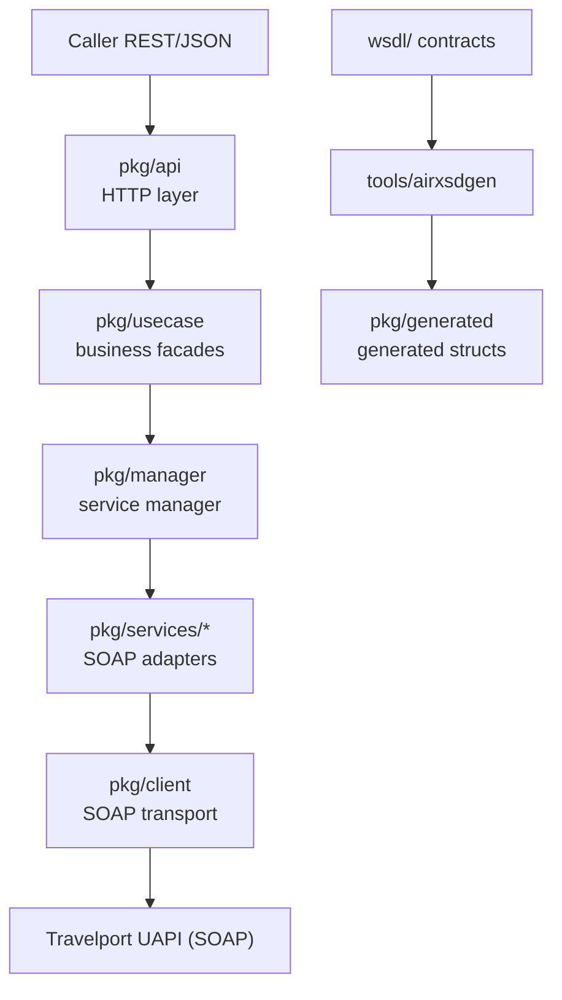

# UAPI Go

**[English](./README.md)** | [简体中文](./README.zh-CN.md)

[](https://github.com/shuiyihan12/uapi-go/actions/workflows/ci.yml)

> A Go REST/JSON gateway wrapping the **SOAP/XML** interfaces of **Travelport Universal API (UAPI)**.
> Covers 13 domains — air, hotel, rail, vehicle, universal record, profiles, GDS queues, terminal, utilities and more — with **181 HTTP endpoints**.

---

## 1. What is this

[Travelport UAPI](https://developer.travelport.com/) is Travelport's aggregated GDS interface (air, hotel, rail, vehicle, Universal Record, UProfile, ...). It is native **SOAP/XML**, split by product into multiple services, each with dozens of PortType operations.

This project wraps those SOAP operations into a REST/JSON gateway written in Go:

- **Outward**: stable, easy-to-call HTTP endpoints (`POST /api/<domain>/<op>`), JSON request bodies, and responses that are strongly typed structs of the upstream SOAP responses.
- **Inward**: keeps SOAP's type safety and payload traceability (raw XML is logged per `trace_id`).
- **Contract**: upstream WSDL/XSD generates Go code at **build time**, surfacing interface changes at compile and test time.

A good fit for: travel agencies / TMCs / ticketing agents' engineering teams that want to integrate GDS capabilities into their systems quickly.

Confused by GDS jargon? Start with [`docs/glossary.md`](./docs/glossary.md).

---

## 2. Coverage (13 domains / 181 endpoints)

| Domain | Route prefix | Endpoints | Highlights |
|---|---|---|---|
| Air | `/api/air` | 29 | search / pricing / ticketing / refunds & exchanges / EMD / seat maps / ancillaries |
| Hotel | `/api/hotel` | 10 (incl. 2 custom DTOs) | search / details / rate rules / media / book & cancel (aliases) |
| Rail | `/api/rail` | 7 | availability / seat maps / exchange & refund / create booking (alias) |
| Vehicle | `/api/vehicle` | 10 | search / locations / rules / book & cancel (aliases) |
| Universal Record | `/api/universal` | 23 | cross-product create/cancel/modify, saved trips, passive segments, provider reservations |
| Passive | `/api/passive` | 2 | passive segment create/cancel (aliases; no standalone WSDL) |
| Shared Booking | `/api/sharedBooking` | 15 | PNR element-level booking operations |
| UProfile | `/api/uprofile` | 25 | profile CRUD / fields / tags / hierarchy / templates |
| SharedUProfile | `/api/sharedUprofile` | 20 | shared profiles and UI metadata |
| GdsQueue | `/api/gdsQueue` | 8 | queue lists / counts / place & exit / agents |
| Terminal | `/api/terminal` | 3 | terminal session create / command / end |
| System | `/api/system` | 4 | ping / info / time / cache |
| Util | `/api/util` | 24 | taxes / currency / MCO / MCT / reference data / branded fares |

> Full route ↔ SOAP operation ↔ upstream service mapping: [`docs/routing.md`](./docs/routing.md).
> **Alias routes**: air/hotel/rail/vehicle "create booking / cancel" are exposed under their product URLs (e.g. `/api/air/book`) but proxy to `UniversalRecordService` underneath (Travelport places these operations in the universal record; see [`docs/architecture.md` §4](./docs/architecture.md)).

---

## 3. Architecture at a glance



Design principle: **each layer knows only its own little slice**; `pkg/api → pkg/usecase → pkg/services → pkg/client` is a one-way dependency. Adding an upstream operation concentrates changes in "register route + facade method + SOAP payload assembly" — the HTTP protocol and transport layers stay untouched.

Full architecture, layer responsibilities, call chains, code-generation strategy and import constraints: [`docs/architecture.md`](./docs/architecture.md). For version history and breaking-change migration notes see [`docs/CHANGELOG.md`](./docs/CHANGELOG.md) (versioning scheme: date-increasing `vYY.M.D`; tagging a release requires a tag; patch bumps add `.N`).

---

## 4. Quick start

| Task | Command |
|---|---|
| Install / update dependencies | `./scripts/build.sh deps` (`go mod tidy` + `go mod download`) |
| Regenerate Go structs | `./scripts/build.sh wsdl` (runs `tools/airxsdgen`) |
| Build all commands | `./scripts/build.sh build` |
| Start the service | `./scripts/start-daemon.sh` (or `go run ./cmd/daemon` in development) |
| Containerized build & run | `docker compose up -d --build` (see [§6](#6-startup-and-configuration)) |
| Full verification | `./scripts/build.sh all` (generation + build + test + lint) |

> Go structs are regenerated by a **script** (`tools/airxsdgen`) that translates the XSDs under `wsdl/` into Go structs by `targetNamespace`. **Never hand-edit `pkg/generated/`**.

---

## 5. Setup, build and test

```bash
./scripts/build.sh deps      # install and tidy dependencies
./scripts/build.sh wsdl      # regenerate WSDL code
./scripts/build.sh build     # build all commands
./scripts/build.sh test      # run tests
./scripts/build.sh all       # full verification
```

Currently on Go `1.25.0`. The generator splits output into independent Go packages by namespace; **package names carry no version** (`air`, `hotel`, ...) so import paths stay stable across contract upgrades (e.g. v55→v56); only the multi-version `commonNN` family keeps its version because several versions coexist; enumerations live in `enums` sub-packages. Because `air↔rail↔universal` reference each other recursively, the three merge into `air`, and `universal` keeps only enums (see [`docs/architecture.md` §3.2](./docs/architecture.md)). Current upstream contract version: **v55_0** (11 core domains; system/terminal/uprofile etc. remain on their own historical versions).

---

## 6. Startup and configuration

```bash
# Build (stale binaries not in the build manifest are cleaned from bin/ automatically)
./scripts/build.sh build

# Copy and edit .env (a default template is provided in .env.example)
vim .env

# Start the daemon with .env (default API port 8080, shared by business and ops endpoints)
./scripts/start-daemon.sh

# Or run from source during development
set -a && source .env && set +a
go run ./cmd/daemon
```

Startup rules:
- **Auth and region are request-level configuration**: callers send `Authorization` (e.g. `Basic xxx` / `Bearer xxx`) and `X-UAPI-Region` (`americas` / `apac` / `emea`) in **every HTTP request header**; the gateway forwards them verbatim to UAPI. Nothing needs to be configured at startup.
- `UAPI_ENDPOINT` is the Java-SDK-style base endpoint prefix (e.g. `https://apac.universal-api.travelport.com/B2BGateway/connect/uAPI`), used only when a request carries no `X-UAPI-Region`; the service layer appends `AirService`, `UniversalRecordService`, etc.
- Request-level business parameters such as `TargetBranch`, `ProviderCode`, `OriginApplication` and `CIDBNumber` are **provided explicitly by the caller in each request body** — startup configuration no longer injects them.
- Optional flags: `-env` (default `test`), `-port` (`8080`, env var `PORT`).

Optional UAPI parameters and defaults:

| Env var | Required | Default | Description |
|---|---|---|---|
| `UAPI_ENDPOINT` | no | `https://apac.universal-api.travelport.com/B2BGateway/connect/uAPI` | default endpoint prefix (used when the request has no `X-UAPI-Region`) |
| `UAPI_CONNECTION_TIMEOUT` | no | `45000` | connect timeout (ms) |
| `UAPI_READ_TIMEOUT` | no | `90000` | response-header timeout (ms) |
| `UAPI_REQUEST_TIMEOUT` | no | `90000` | per-request total timeout (ms) |
| `UAPI_MAX_IDLE_CONNS` | no | `100` | max idle keep-alive connections kept warm across all upstream hosts |
| `UAPI_MAX_IDLE_CONNS_PER_HOST` | no | `100` | max idle keep-alive connections per host (capped by `UAPI_MAX_IDLE_CONNS`) |
| `UAPI_SKIP_TLS_VERIFY` | no | unset (verify certificates) | set to `1` only for private environments (self-signed certificates); keep unset in production |

> `Authorization` and `X-UAPI-Region` are not configured via environment variables; callers send them in every request header — see "Request headers" below.

Request headers (every business request):

| Header | Required | Description |
|---|---|---|
| `Authorization` | yes | Travelport auth header, e.g. `Basic xxx` / `Bearer xxx`; forwarded verbatim to UAPI |
| `X-UAPI-Region` | no | region: `americas` / `apac` / `emea` (Production only, case-insensitive); falls back to the `UAPI_ENDPOINT` default when absent — invalid values are ignored with a warning log |
| `X-Trace-Id` | no | caller-supplied global trace ID for this request; auto-generated (UUID v4) when absent. Propagated through logs, outbound HTTP headers and (only when the body's `TraceId` is empty) as a fallback into the body's `TraceId` attribute; the actual trace_id used is echoed back in a response header |

Example:

```bash
curl -X POST http://localhost:8080/api/air/low-fare-search \
  -H "Authorization: Basic xxxx" \
  -H "X-UAPI-Region: apac" \
  -H "Content-Type: application/json" \
  -d '{ ... }'
```

> This project **does not retry**: any single failed SOAP call (network / system / timeout / business error) returns immediately and is handled by the caller.

Auth and observability:
- **Auth**: callers send `Authorization` in request headers; `pkg/client` forwards it verbatim to UAPI via context (no startup-time environment variable).
- **Global trace ID**: the trace_id prefers the caller's `X-Trace-Id` header, otherwise the gateway generates one (UUID v4). It flows through context into the log `trace_id` field, the outbound `X-Trace-Id` HTTP header, and (only when the body's `TraceId` is empty) a fallback injection into the body's `TraceId` attribute. The gateway echoes the actual trace_id in the `X-Trace-Id` response header. Propagation follows W3C Trace Context / OpenTelemetry boundary principles: tracing rides on HTTP headers rather than the request body; the gateway never overwrites a caller-supplied business `TraceId`.
- **XML logging**: raw SOAP request/response XML is logged (unformatted) tagged with the `trace_id` for payload inspection.

Health and monitoring endpoints (sharing the API port, default `8080`): `/health`, `/ready`, `/stats`, `/metrics`.
- `/health` issues a **real upstream SystemPing**; auth follows the same pass-through principle — the prober (monitoring system / k8s probe) sends `Authorization` in the request header, forwarded verbatim to UAPI. Without credentials the upstream rejects and `/health` returns 503 (truthfully reflecting "cannot verify upstream reachability").
- `/ready` is a process self-check; `/metrics` serves Prometheus metrics.
- Upstream TLS certificate verification is on by default; skipped only via explicit `UAPI_SKIP_TLS_VERIFY=1` (private self-signed environments).
Business endpoints live under the `/api` prefix (no version segment).

### 6.1 Containerized deployment

The project ships production-grade container tooling: a multi-stage [`Dockerfile`](./Dockerfile) (dependency caching + static compilation + **distroless non-root runtime image** — no shell, minimal attack surface), [`docker-compose.yml`](./docker-compose.yml) and Kubernetes manifests under [`deploy/k8s/`](./deploy/k8s/).

```bash
# Build (VERSION is baked into the binary and visible in startup logs; buildx multi-arch supported;
# versioning scheme in docs/CHANGELOG.md)
docker build -t shuiyihan/uapi-go:v26.8 --build-arg VERSION=v26.8 .

# Run (configuration via UAPI_* env vars; credentials still travel per business request header,
# never baked into the container)
docker run -d --name uapi-go -p 8080:8080 \
  -e UAPI_ENV=production shuiyihan/uapi-go:v26.8

# Or one-shot with docker compose (optional --profile monitoring adds Prometheus)
docker compose up -d --build
docker compose --profile monitoring up -d
```

> **Networks that cannot reach gcr.io**: the runtime base image is hosted on `gcr.io`; if pulls
> time out, point `UAPI_RUNTIME_IMAGE` at a trusted mirror (the runtime image is the container's
> trust anchor — use trusted sources only), or configure a Docker proxy and build unchanged:
> ```bash
> UAPI_RUNTIME_IMAGE=<mirror>/distroless/static-debian12:nonroot docker compose up -d --build
> ```

Kubernetes ([`deploy/k8s/`](./deploy/k8s/)):

```bash
kubectl create secret generic uapi-go-health \
  --from-literal=authorization='Basic xxxx'   # /health probe credentials (for readiness)
kubectl apply -f deploy/k8s/
```

Probe design (consistent with §6 health semantics):
- **livenessProbe → `/ready`** (process self-check): restarts only when the process is wedged; upstream flaps never kill the pod;
- **readinessProbe → `/health`** (exec probe + Secret-injected credentials): a real upstream SystemPing; when the upstream is unreachable the pod is merely removed from endpoints, not restarted.

Security baseline: non-root user (uid 65532), read-only root filesystem, `allowPrivilegeEscalation=false`, all Linux capabilities dropped, seccomp RuntimeDefault.

### 6.2 Capacity planning

The gateway is stateless and scales horizontally; per-node capacity is
**memory-bound, not thread-bound** — Go goroutines make waiting nearly free.
The real limits, in the order they are usually hit:

1. **Travelport account quota** — the GDS caps concurrent transactions per account; this typically tops out first and only Travelport can raise it.
2. **Gateway memory** — each in-flight request holds its XML/JSON payloads (peak ~1–2 MB for search-heavy calls), so 2 GB sustains a few hundred in-flight.
3. **File descriptors (fd)** — the OS quota of simultaneously open files/connections per process. Every TCP connection (inbound from callers, outbound to the GDS) consumes one fd; see the fd walkthrough below.
4. **Ephemeral ports** — as a client, ~28k concurrent outbound connections to a single GDS endpoint; rarely reachable in practice.

Order-of-magnitude estimates per node (assuming ~1–2 MB peak memory per
in-flight request — **validate with your own load tests; these are not
benchmarks**):

| Node | Typical role | Est. in-flight ceiling | Est. throughput |
|---|---|---|---|
| 2 vCPU / 2 GB | dev / small internal | ~200–400 | light ops: several hundred req/s; heavy search ops: tens of req/s |
| 2 vCPU / 4 GB | small production | ~500–1,000 | roughly 2× the 2 GB node |
| 4 vCPU / 8 GB | standard production | ~1,000–2,000 | light: low thousands req/s; heavy: 100–300 req/s |
| 8 vCPU / 16 GB | high throughput | ~2,000–4,000 | scale out with replicas beyond this |

**Raising the fd limit (do once on bare metal)**: most Linux distributions default to a soft limit of 1024 fds per process — with two connections per in-flight request, ~500 in-flight hits that wall before anything else, and new connections fail with the classic `too many open files` error. Check with `ulimit -n`, then raise it in the service's startup script (e.g. `ulimit -n 65535`) or via `LimitNOFILE=` in the systemd unit. Raising it is safe: idle fds cost almost nothing, and once raised the binding constraint returns to memory. Container / Kubernetes runtimes usually ship a high limit already, so no action is needed there.

Watch `uapi_active_requests` on `/metrics` for live in-flight load; scaling out is a `replicas` bump (the gateway holds no state) — but it scales your side only, never the GDS account quota.

---

## 7. Request / response conventions

- All business endpoints are `POST` with JSON bodies.
- JSON decoding **rejects unknown fields**, preventing silently misspelled field names.
- **`X-Trace-Id` response header**: both success and error responses echo the actual trace_id used, letting callers correlate with logs and GDS payloads.
- **`TransactionId` is not handled by the gateway**: it is generated automatically by Travelport upstream, uniquely identifies one request-response pair, appears only in the `<...Rsp>` root attributes and SOAPFault echoes, and is surfaced directly as the `transactionId` / `transaction_id` field of the response JSON — the gateway neither injects nor propagates it.
- Successful responses are strongly typed structs of the upstream SOAP response (snake_case JSON), directly consumable; raw XML payloads are kept in logs (correlated by `trace_id`) for troubleshooting.
- GDS business errors (expired fares, sold-out seats, ...) surface as SOAP faults.

---

## 8. Project structure

```text
uapi-go/
  cmd/daemon/        process entry point (business API + ops endpoints, single port)
  cmd/healthcheck/   container probe helper (Docker HEALTHCHECK / k8s exec probe)
  pkg/api/           HTTP layer and route registration
  pkg/usecase/       business use-case layer (one facade per domain)
  pkg/manager/       service manager (ServiceManager)
  pkg/services/*/    SOAP operation adapters (air/rail/vehicle/hotel/universal/...)
  pkg/client/        SOAP transport (envelope / auth / logging / errors)
  pkg/generated/ generated Go structs (never hand-edit)
  pkg/trace/         global trace_id
  internal/          internal infrastructure (logging, metrics)
  wsdl/              upstream WSDL/XSD contracts (archived by service / version; copyright Travelport, see LICENSE notes)
  tools/airxsdgen/   code generator
  scripts/           build / generation / startup scripts
  docs/              architecture, routing, glossary, contributor docs
  deploy/k8s/        Kubernetes manifests (Deployment / Service / Secret example)
  docker/            container companion config (Prometheus scraping etc.)
  Dockerfile         multi-stage build (distroless non-root production image)
  docker-compose.yml local / single-host orchestration (optional monitoring stack)
```

Development constraints:
- `pkg/generated/` is a generated asset, never hand-edited; upstream upgrades go through build-time regeneration.
- Business changes concentrate in `pkg/api`, `pkg/usecase`, `pkg/services/<domain>` and `cmd/daemon`.
- Field exposure prefers explicit DTO mapping over implicit `map[string]interface{}` pass-through.

---

## 9. Documentation

| Document | Contents |
|---|---|
| [`docs/architecture.md`](./docs/architecture.md) | architecture, layer responsibilities, call chains, code-generation strategy, UniversalRecord aggregation model, request/response conventions, contract upgrade process, architecture decision records (ADR) |
| [`docs/development.md`](./docs/development.md) | contributor guide: exposing new endpoints / onboarding new domains / contract upgrades / business orchestration, step-by-step by scenario |
| [`docs/routing.md`](./docs/routing.md) | full mapping of routes ↔ SOAP operations ↔ Go facades ↔ upstream services ↔ alias proxies |
| [`docs/glossary.md`](./docs/glossary.md) | plain-language explanations of GDS / UAPI / Universal Record / PNR / EMD / MCO / Saved Trip and more |
| [`docs/CHANGELOG.md`](./docs/CHANGELOG.md) | version history and breaking-change migration notes |
| [`CONTRIBUTING.md`](./CONTRIBUTING.md) | contribution guide: environment, workflow, code/test conventions, commit and PR rules |
| [Travelport developer docs](https://developer.travelport.com/) | official upstream documentation (the authoritative reference for every operation) |

Chinese translations of this README and the docs above are provided as `*.zh-CN.md` counterparts (e.g. [`README.zh-CN.md`](./README.zh-CN.md)).

---

## 10. License

This project is open-sourced under the [**Apache License 2.0**](./LICENSE) (see [`NOTICE`](./NOTICE)).

Why Apache-2.0:
- **Patent grant**: explicit patent terms beyond MIT and friends — the safer pick for infrastructure software;
- **Commercial-friendly**: commercial use, modification and private deployment allowed; low legal-review cost for enterprise users (TMCs / ticketing agents);
- **Ecosystem consistency**: matches the Go infrastructure ecosystem (Kubernetes, gRPC) and Travelport's official SDKs.

Boundaries:
- the WSDL/XSD files under `wsdl/` are **Travelport's upstream contract artifacts**, copyrighted by Travelport and outside this project's license (archived for build-time code generation under their developer terms);
- third-party dependencies are all permissively licensed (zap: MIT; prometheus: Apache-2.0; golang.org/x/*: BSD) — compatible with Apache-2.0;
- "Travelport" is a Travelport trademark; this project is not affiliated with or endorsed by Travelport.
