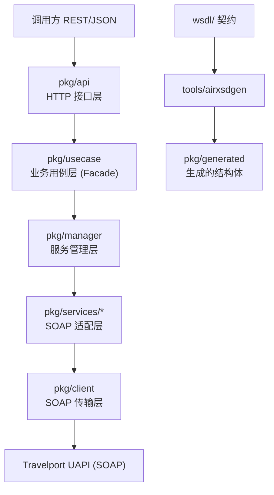

# UAPI Go

[](https://github.com/shuiyihan12/uapi-go/actions/workflows/ci.yml)

[English](./README.md) | **简体中文**

> 把 **Travelport Universal API（UAPI）** 的 SOAP/XML 接口，封装成易用的 **Go REST/JSON 网关**。
> 覆盖机票、酒店、火车、租车、统一记录、客户档案、GDS 队列、终端、工具等 13 个域，**181 个 HTTP 接口**。

---

## 1. 这是什么

[Travelport UAPI](https://developer.travelport.com/) 是 Travelport 提供的 GDS 聚合接口（机票 Air、酒店 Hotel、火车 Rail、租车 Vehicle、统一记录 Universal Record、客户档案 UProfile 等），原生是 **SOAP/XML**，按产品拆成多个 Service，每个 Service 下又有几十个 PortType 操作。

本项目把这些 SOAP 操作封装成一个 Go 编写的 REST/JSON 网关：

- **对外**：稳定、好调用的 HTTP 接口（`POST /api/<domain>/<op>`），请求体 JSON，响应是上游 SOAP 响应的强类型结构体。
- **对内**：保留 SOAP 的类型安全与报文可追溯性（原始 XML 按 `trace_id` 留痕）。
- **契约**：上游 WSDL/XSD 在**构建期**生成 Go 代码，把接口变化前置到编译和测试阶段。

适合：旅行社 / 差旅管理（TMC）/ 机票代理的技术团队，想把 GDS 能力快速接入自己的系统。

读不懂 GDS 黑话？先看 [`docs/glossary.md`](./docs/glossary.zh-CN.md)（术语表）。

---

## 2. 已接入能力（13 域 / 181 接口）

| 域 | 路由前缀 | 接口数 | 主要能力 |
|---|---|---|---|
| 机票 Air | `/api/air` | 29 | 检索 / 计价 / 出票 / 退改 / EMD / 座位图 / 辅营 |
| 酒店 Hotel | `/api/hotel` | 10（含 2 自定义 DTO） | 搜索 / 详情 / 房价规则 / 媒体 / 预订·取消（别名） |
| 火车 Rail | `/api/rail` | 7 | 余票 / 座位图 / 退改 / 创建预订（别名） |
| 租车 Vehicle | `/api/vehicle` | 10 | 搜索 / 门店 / 规则 / 预订·取消（别名） |
| 统一记录 Universal | `/api/universal` | 23 | 跨产品创建/取消/修改、保存行程、被动段、供应商预订 |
| 被动段 Passive | `/api/passive` | 2 | 被动段创建/取消（别名，无独立 WSDL） |
| 共享预订 Shared Booking | `/api/sharedBooking` | 15 | PNR 元素级预订操作 |
| 客户档案 UProfile | `/api/uprofile` | 25 | 档案增删改查 / 字段 / 标签 / 层级 / 模板 |
| 共享客户档案 SharedUProfile | `/api/sharedUprofile` | 20 | 共享档案与 UI 元数据 |
| GDS 队列 GdsQueue | `/api/gdsQueue` | 8 | 队列列表 / 计数 / 入出队 / 坐席 |
| 终端 Terminal | `/api/terminal` | 3 | 终端会话创建 / 指令 / 结束 |
| 系统 System | `/api/system` | 4 | 探活 / 信息 / 时间 / 缓存 |
| 工具 Util | `/api/util` | 24 | 税费 / 币种 / MCO / MCT / 参考数 / 品牌运价 |

> 完整路由 ↔ SOAP 操作 ↔ 上游服务对照见 [`docs/routing.md`](./docs/routing.zh-CN.md)。
> **别名路由**：机票/酒店/火车/租车的"创建预订 / 取消"在产品 URL 下暴露（如 `/api/air/book`），但底层代理到 `UniversalRecordService`（因为 Travelport 把这些操作放在统一记录里，详见 [`docs/architecture.md` §4](./docs/architecture.zh-CN.md)）。

---

## 3. 架构一览



设计原则：**每一层只懂自己那一小段**，`pkg/api → pkg/usecase → pkg/services → pkg/client` 单向依赖。新增一个上游操作，改动集中在「注册路由 + Facade 方法 + SOAP 报文组装」，HTTP 协议与传输层不动。

完整架构、分层职责、调用链路、代码生成策略与 import 约束，见 [`docs/architecture.md`](./docs/architecture.zh-CN.md)；各版本变更与破坏性迁移说明见 [`docs/CHANGELOG.md`](./docs/CHANGELOG.zh-CN.md)（版本规范：`v0.WSDL.PATCH`，WSDL 为 Travelport 契约版本号，如 `v0.55.1`；仅打 tag 视为发版，补丁号递增末段）。

---

## 4. 快速开始（Quick Start）

| 你想做的事 | 命令 |
|---|---|
| 安装 / 更新依赖 | `./scripts/build.sh deps`（`go mod tidy` + `go mod download`） |
| 重新生成 Go struct | `./scripts/build.sh wsdl`（运行 `tools/airxsdgen`） |
| 构建全部命令 | `./scripts/build.sh build` |
| 启动服务 | `./scripts/start-daemon.sh`（或开发期 `go run ./cmd/daemon`） |
| 容器化构建与运行 | `docker compose up -d --build`（详见 [§6 容器化部署](#6-启动与配置)） |
| 全量校验 | `./scripts/build.sh all`（生成 + 构建 + 测试 + lint） |

> 重新生成 Go struct 用的是**脚本**（`tools/airxsdgen`），按 `targetNamespace` 把 `wsdl/` 下的 XSD 自动翻译成 Go struct，**不要手工改 `pkg/generated/`**。

---

## 5. 初始化、构建与测试

```bash
./scripts/build.sh deps      # 安装和整理依赖
./scripts/build.sh wsdl      # 重新生成 WSDL 代码
./scripts/build.sh build     # 构建所有命令
./scripts/build.sh test      # 运行测试
./scripts/build.sh all       # 全量验证
```

当前使用 Go `1.25.0`。生成器按命名空间拆分为独立 Go 包；**包名不带版本号**（`air`、`hotel`…），契约升级（如 v55→v56）时 import 路径保持稳定，仅 `commonNN` 系因多版本并存而保留版本号；枚举在 `enums` 子包。因 `air↔rail↔universal` 相互递归引用，三者合并为 `air`，`universal` 仅保留枚举（详见 [`docs/architecture.md` §3.2](./docs/architecture.zh-CN.md)）。当前上游契约版本为 **v55_0**（11 个核心域；system/terminal/uprofile 等仍为各自的历史版本）。

---

## 6. 启动与配置

```bash
# 构建（自动清理 bin/ 中不在构建清单的陈旧可执行文件）
./scripts/build.sh build

# 复制并编辑 .env（已提供默认模板 .env.example）
vim .env

# 用 .env 启动 daemon（默认 API 端口 8080，业务与运维端点共用）
./scripts/start-daemon.sh

# 或开发调试直接跑源码
set -a && source .env && set +a
go run ./cmd/daemon
```

启动规则：
- **鉴权与区域是请求级配置**：调用方在**每个 HTTP 请求头**携带 `Authorization`（如 `Basic xxx` / `Bearer xxx`）与 `X-UAPI-Region`（`americas` / `apac / emea`），网关原样透传给 UAPI，无需在启动配置里设置。
- `UAPI_ENDPOINT` 用 Java SDK 同款基础端点前缀（如 `https://apac.universal-api.travelport.com/B2BGateway/connect/uAPI`），仅在请求未携带 `X-UAPI-Region` 时作为默认端点；服务层自动拼接 `AirService`、`UniversalRecordService` 等。
- `TargetBranch`、`ProviderCode`、`OriginApplication`、`CIDBNumber` 等**请求级业务参数由调用方在每个请求体里显式提供**，启动配置不再注入。
- 可选参数：`-env`（默认 `test`）、`-port`（`8080`，环境变量 `PORT`）。

可选 UAPI 参数及默认值：

| 环境变量 | 必填 | 默认值 | 说明 |
|---|---|---|---|
| `UAPI_ENDPOINT` | 否 | `https://apac.universal-api.travelport.com/B2BGateway/connect/uAPI` | UAPI 默认端点前缀（请求未带 `X-UAPI-Region` 时使用） |
| `UAPI_CONNECTION_TIMEOUT` | 否 | `45000` | 建连超时（毫秒） |
| `UAPI_READ_TIMEOUT` | 否 | `90000` | 读响应头超时（毫秒） |
| `UAPI_REQUEST_TIMEOUT` | 否 | `90000` | 单请求总超时（毫秒） |
| `UAPI_MAX_IDLE_CONNS` | 否 | `100` | 全部上游主机合计保温的空闲 keep-alive 连接上限 |
| `UAPI_MAX_IDLE_CONNS_PER_HOST` | 否 | `100` | 单主机保温的空闲 keep-alive 连接上限（受 `UAPI_MAX_IDLE_CONNS` 封顶） |
| `UAPI_SKIP_TLS_VERIFY` | 否 | 未设置（校验证书） | 仅私有环境（自签名证书）设为 `1`；生产务必保持未设置 |

> `Authorization` 与 `X-UAPI-Region` 不在环境变量里配置，而是由调用方在每个请求头携带，见下方「请求头」。

请求头（每个业务请求都必须 / 建议携带）：

| 请求头 | 必填 | 说明 |
|---|---|---|
| `Authorization` | 是 | Travelport 鉴权头，如 `Basic xxx` / `Bearer xxx`，原样透传给 UAPI |
| `X-UAPI-Region` | 否 | 区域：`americas` / `apac` / `emea`（仅 Production，大小写不敏感）；不填则用 `UAPI_ENDPOINT` 默认端点，非法值将被忽略并记录告警日志 |
| `X-Trace-Id` | 否 | 调用方指定的本次请求全局追踪 ID（trace_id）；不填则由网关自动生成（UUID v4）。网关按 context 贯穿日志、出站 HTTP 头、（仅当请求体 `TraceId` 为空时）兜底注入请求体 `TraceId` 属性，并在响应头回写本次实际使用的 trace_id |

示例：

```bash
curl -X POST http://localhost:8080/api/air/low-fare-search \
  -H "Authorization: Basic xxxx" \
  -H "X-UAPI-Region: apac" \
  -H "Content-Type: application/json" \
  -d '{ ... }'
```

> 本项目**不启用重试**：任何单次 SOAP 调用失败（网络 / 系统 / 超时 / 业务错误）都直接返回，由调用方处理。

鉴权与可观测性：
- **鉴权**：调用方在请求头携带 `Authorization`，由 `pkg/client` 经 context 原样透传给 UAPI（不再使用启动期环境变量）。
- **全局追踪 ID**：trace_id 优先来自调用方的 `X-Trace-Id` 请求头，未传时由网关生成（UUID v4），经 context 贯穿日志 `trace_id` 字段、出站 HTTP 头 `X-Trace-Id`、（仅当请求体 `TraceId` 为空时）兜底注入请求体 `TraceId` 属性。网关在响应头 `X-Trace-Id` 回写本次实际使用的 trace_id。该传播遵循 W3C Trace Context / OpenTelemetry 边界透传原则：trace 走 HTTP 头而非依请求体承载；网关不覆盖调用方在请求体里显式填写的 `TraceId` 业务值。
- **XML 日志**：GDS 的 SOAP 请求 / 响应原始 XML 以 `trace_id` 标记打印到日志（不格式化），便于核对报文。

健康与监控端点（与业务接口共用 API 端口，默认 `8080`）：`/health`、`/ready`、`/stats`、`/metrics`。
- `/health` 对上游发起**真实 SystemPing**；鉴权同样遵循透传原则——探活调用方（监控系统 / k8s probe）在请求头携带 `Authorization`，网关原样透传给 UAPI。未携带凭据时上游拒绝，`/health` 返回 503（真实反映「无法验证上游可达」）。
- `/ready` 为进程就绪自检；`/metrics` 输出 Prometheus 指标。
- 上游 TLS 证书校验默认开启；仅经 `UAPI_SKIP_TLS_VERIFY=1` 显式跳过（私有环境自签名证书场景）。
业务接口统一挂在 `/api` 前缀下（无版本号）。

### 6.1 容器化部署

项目自带生产级容器设施：多阶段构建的 [`Dockerfile`](./Dockerfile)（构建期依赖缓存 + 静态编译 + **distroless 非根运行时镜像**，无 shell、攻击面最小）、[`docker-compose.yml`](./docker-compose.yml) 与 [`deploy/k8s/`](./deploy/k8s/) 部署清单。

```bash
# 构建（VERSION 会注入二进制，启动日志可见；支持 buildx 多架构；版本规范见 docs/CHANGELOG.md）
docker build -t shuiyihan/uapi-go:v0.55.1 --build-arg VERSION=v0.55.1 .

# 运行（配置经 UAPI_* 环境变量传入；凭据仍由业务请求头逐个透传，不入容器）
docker run -d --name uapi-go -p 8080:8080 \
  -e UAPI_ENV=production shuiyihan/uapi-go:v0.55.1

# 或 docker compose 一键起（可选 --profile monitoring 附带 Prometheus）
docker compose up -d --build
docker compose --profile monitoring up -d
```

> **gcr.io 不可达的网络环境**：运行时基础镜像托管在 `gcr.io`，若拉取超时可经
> `UAPI_RUNTIME_IMAGE` 指向受信镜像源（运行时镜像是容器信任锚点，仅用可信源），或给
> Docker 配置代理后原样构建：
> ```bash
> UAPI_RUNTIME_IMAGE=<mirror>/distroless/static-debian12:nonroot docker compose up -d --build
> ```

Kubernetes（[`deploy/k8s/`](./deploy/k8s/)）：

```bash
kubectl create secret generic uapi-go-health \
  --from-literal=authorization='Basic xxxx'   # /health 探活凭据（readiness 用）
kubectl apply -f deploy/k8s/
```

探针设计（与 §6 健康语义一致）：
- **livenessProbe → `/ready`**（进程自检）：进程僵死才重启，不因上游抖动误杀 Pod；
- **readinessProbe → `/health`**（exec 探针 + Secret 注入凭据）：对上游真实 SystemPing，上游不可达时只摘除流量、不重启。

安全基线：非根用户（uid 65532）、只读根文件系统、`allowPrivilegeEscalation=false`、丢弃全部 Linux capabilities、seccomp RuntimeDefault。

### 6.2 容量规划

网关无状态、可水平扩展；单节点容量瓶颈在**内存而非线程**——Go goroutine 让"等待"几乎零成本。
真正会依次撞到的限制，按先后顺序：

1. **Travelport 账号配额**——GDS 侧按账号限制并发/事务量，通常最先到顶，且只能向 Travelport 申请调高；
2. **网关内存**——每个在途请求要装下 XML/JSON 报文（重搜索峰值约 1–2 MB），2 GB 约支撑几百在途；
3. **文件描述符（fd）**——操作系统分配给每个进程的"同时打开文件/连接数"配额。每条 TCP 连接（调用方入向 + 到 GDS 出向）各占一个 fd，详见下方"调高 fd 上限"；
4. **临时端口**——作为客户端对单一 GDS 端点最多约 2.8 万条并发出向连接，实践中基本撞不到。

单节点数量级估算（假设搜索类重报文的 XML/JSON 转码峰值每在途请求约 1–2 MB——
**以你自己的压测为准，以下非基准数据**）：

| 机型 | 典型角色 | 在途并发上限（估） | 吞吐（估） |
|---|---|---|---|
| 2 vCPU / 2 GB | 开发 / 小型内部 | ~200–400 | 轻操作：数百 req/s；重搜索：数十 req/s |
| 2 vCPU / 4 GB | 小型生产 | ~500–1,000 | 约为 2 GB 节点的 2 倍 |
| 4 vCPU / 8 GB | 标准生产 | ~1,000–2,000 | 轻操作：数千 req/s；重搜索：100–300 req/s |
| 8 vCPU / 16 GB | 高吞吐 | ~2,000–4,000 | 超出后用副本横向扩展 |

**调高 fd 上限（裸机部署做一次）**：多数 Linux 发行版默认软限制为每进程 1024——按每个在途请求占 2 条连接计算，约 500 在途就会最先撞墙，新连接直接失败并报经典的 `too many open files` 错误。先用 `ulimit -n` 查看当前值，再在服务启动脚本中调高（如 `ulimit -n 65535`，或 systemd 单元里的 `LimitNOFILE=`）。调高是安全的：空闲 fd 几乎不耗资源，调高之后真正的约束就回到内存。容器 / Kubernetes 环境通常默认已放开，无需处理。

通过 `/metrics` 的 `uapi_active_requests` 观察实时在途负载；横向扩展只是加 `replicas`（网关无状态）——但它只扩展你这一侧，扩不了 GDS 账号配额。

---

## 7. 请求 / 响应约定

- 所有业务接口均为 `POST`，请求体 JSON。
- 请求体 JSON 解码**拒绝未知字段**，防止拼错字段名静默失效。
- **`X-Trace-Id` 响应头**：成功 / 错误响应统一回写本次实际使用的 trace_id，调用方凭此与日志、GDS 报文关联。
- **`TransactionId` 不由网关处理**：它是 Travelport 上游自动生成、唯一标识单次请求-响应对的标识符，仅出现在响应 `<...Rsp>` 根属性与 SOAPFault 回显里，直接透出到响应 JSON 的 `transactionId` / `transaction_id` 字段，调用方从响应体读取即可，网关不注入也不透传。
- 成功响应即上游 SOAP 响应的强类型结构体（snake_case JSON），可直接消费；原始 XML 报文保留在日志中（按 `trace_id` 关联），便于排障。
- GDS 业务错误（运价失效、座位售罄等）以 SOAP Fault 形式透出。

---

## 8. 项目结构

```text
uapi-go/
  cmd/daemon/        进程入口（业务 API + 运维端点，单端口）
  cmd/healthcheck/   容器探活辅助程序（Docker HEALTHCHECK / k8s exec 探针）
  pkg/api/           HTTP 接口层与路由注册
  pkg/usecase/       业务用例层（每个域一个 Facade）
  pkg/manager/       服务管理层（ServiceManager）
  pkg/services/*/    SOAP 操作适配层（air/rail/vehicle/hotel/universal/...）
  pkg/client/        SOAP 传输层（Envelope / 鉴权 / 日志 / 错误）
  pkg/generated/ 生成的 Go 结构体（禁止手工改）
  pkg/trace/         全局 trace_id
  internal/          日志、指标等内部基础设施
  wsdl/              上游 WSDL/XSD 契约（按服务 / 版本归档；版权归 Travelport，见 LICENSE 说明）
  tools/airxsdgen/   代码生成器
  scripts/           构建 / 生成 / 启动脚本
  docs/              架构、路由、术语、二次开发文档
  deploy/k8s/        Kubernetes 部署清单（Deployment / Service / Secret 示例）
  docker/            容器配套配置（Prometheus 抓取等）
  Dockerfile         多阶段构建（distroless 非根生产镜像）
  docker-compose.yml 本地 / 单机编排（可选监控栈）
```

开发约束：
- `pkg/generated/` 是自动生成资产，不手工修改；上游升级走构建期重新生成。
- 业务变更集中在 `pkg/api`、`pkg/usecase`、`pkg/services/<domain>`、`cmd/daemon`。
- 字段接入优先走显式 DTO 映射，避免隐式 `map[string]interface{}` 透传。

---

## 9. 文档导航

| 文档 | 内容 |
|---|---|
| [`docs/architecture.md`](./docs/architecture.zh-CN.md) | 架构、分层职责、调用链路、代码生成策略、UniversalRecord 聚合模型、请求响应约定、契约更新流程、架构决策记录（ADR） |
| [`docs/development.md`](./docs/development.zh-CN.md) | 二次开发指南：暴露新接口 / 接入新域 / 契约升级 / 业务编排，分场景分步教程 |
| [`docs/routing.md`](./docs/routing.zh-CN.md) | 路由 ↔ SOAP 操作 ↔ Go Facade ↔ 上游服务 ↔ 别名代理 完整对照表 |
| [`docs/glossary.md`](./docs/glossary.zh-CN.md) | GDS / UAPI / Universal Record / PNR / EMD / MCO / Saved Trip 等术语中文解释 |
| [Travelport 开发者文档](https://developer.travelport.com/) | 上游官方文档（各操作的权威参考） |
| [`CONTRIBUTING.md`](./CONTRIBUTING.zh-CN.md) | 贡献指南：环境、工作流、代码/测试规范、提交与 PR 约定 |

---

## 10. 许可证

本项目以 [**Apache License 2.0**](./LICENSE) 开源（见 [`NOTICE`](./NOTICE)）。

选择 Apache-2.0 的原因：
- **专利授权**：相比 MIT 等多出显式专利条款，对基础设施软件是更稳妥的选择；
- **商业友好**：允许商用、修改、私有部署，企业用户（TMC / 机票代理技术团队）法务评估成本低；
- **生态一致**：与 Go 基础设施生态（Kubernetes、gRPC）及 Travelport 官方 SDK 的许可一致。

边界说明：
- `wsdl/` 目录下的 WSDL/XSD 是 **Travelport 的上游契约工件**，版权归 Travelport，不在本项目许可范围内（仅按其开发者条款归档用于构建期代码生成）；
- 第三方依赖均为宽松许可（zap：MIT；prometheus：Apache-2.0；golang.org/x/*：BSD），与 Apache-2.0 兼容；
- "Travelport" 是 Travelport 的商标，本项目与其无隶属或背书关系。
