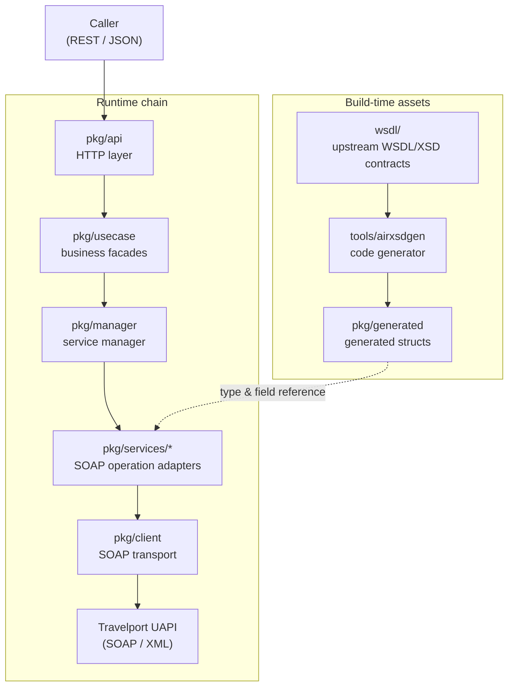
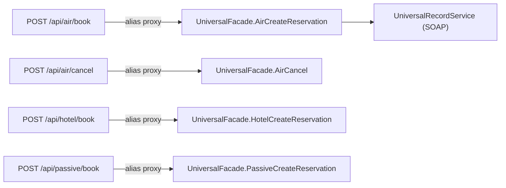
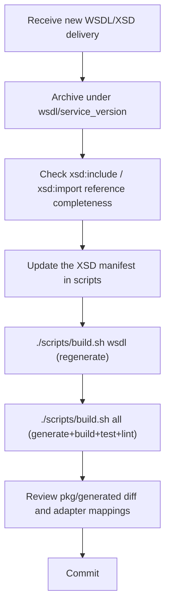

# UAPI Go Architecture

**[English](./architecture.md)** | [简体中文](./architecture.zh-CN.md)

> Audience: engineers integrating Travelport UAPI into their systems, travel agency / TMC / ticketing-agent technical teams, and anyone wrapping GDS capabilities as REST services.
> Confused by GDS jargon? Start with [`glossary.md`](./glossary.md).
> Want to look up which upstream SOAP operation an HTTP endpoint maps to? See [`routing.md`](./routing.md).

---

## 1. The problem this project solves

[Travelport Universal API (UAPI)](https://developer.travelport.com/) is Travelport's aggregated GDS interface (covering air, hotel, rail, vehicle, passive segments, Universal Record, UProfile and more). It is native **SOAP / XML**, split by product into multiple services (e.g. `AirService`, `HotelService`, `UniversalRecordService`), each with dozens of PortType operations (e.g. `AirSearch`, `HotelCreateReservation`).

The interface is powerful, but integrating directly has three pain points:

1. **Heavy protocol**: SOAP envelopes, namespace URIs, `xs:sequence` ordering and enumeration values all have to be hand-aligned; one mistake and the payload fails.
2. **Scattered surface**: a product's "search" lives in `AirService` while "book / cancel" lives in `UniversalRecordService` (see §4) — newcomers easily knock on the wrong door.
3. **Moving contract**: Travelport ships WSDL/XSD by version; fields and enums shift across versions.

This project wraps those SOAP operations into a **REST / JSON gateway written in Go**:

- Outward: stable, easy-to-call HTTP endpoints (`POST /api/<domain>/<op>`).
- Inward: SOAP's type safety and payload traceability preserved (raw XML logged per trace_id).
- Upstream contracts (WSDL/XSD) generate Go code at **build time**, surfacing interface changes at compile and test time instead of runtime.

---

## 2. Layered architecture



### 2.1 Layer responsibilities (single responsibility, no layer crossing)

| Layer | Directory | Owns | Does NOT own |
|---|---|---|---|
| Process entry | `cmd/daemon` | wires ops endpoints (`/health` etc.) and business routes on a single HTTP port (default `8080`); creates facades / handlers | any business or SOAP detail |
| HTTP layer | `pkg/api` | method validation (POST only), body size limits, JSON decoding (unknown fields rejected), timeouts, error → HTTP status mapping, route registration | SOAP field semantics, DTO mapping |
| Business use-case layer | `pkg/usecase` | maps REST inputs to SOAP request structs; isolates the external REST contract from the upstream SOAP contract; fetches service instances via `ServiceManager`. **Pass-through facades are marked "collapsible"**: without business logic they stay thin wrappers, and grow validation / orchestration in place when needed — no cross-layer changes | building XML, HTTP transport |
| Service manager | `pkg/manager` | creation, lazy loading and caching of upstream service instances; exposed via the type-safe generic `manager.Get[T](m, key)` plus the factory registry `buildServiceFactories` (adding a domain is one registration, no new getters — open/closed principle) | business logic |
| SOAP adapters | `pkg/services/*` | define and assemble each PortType's SOAP request / response structs, fill in namespaces, call `pkg/client` | the REST protocol, auth-header pass-through |
| SOAP transport | `pkg/client` | envelope assembly, `Authorization` injection, timeouts / TLS / connection pooling, XML logging, SOAP Fault parsing | business field semantics |
| Generated code | `pkg/generated` | Go structs translated from WSDL/XSD (**never hand-edit**) | — |
| Contract source | `wsdl/` | XSDs and WSDLs archived by service / version | — |

> **Design highlight**: `pkg/api` → `pkg/usecase` → `pkg/services` → `pkg/client` is a one-way dependency chain; each layer knows only its own slice. Adding an upstream operation concentrates changes in `pkg/api` (register the route) + `pkg/usecase` (facade method) + `pkg/services` (assemble the payload) — the HTTP protocol and transport layers stay untouched.

### 2.2 What happens in one call (`POST /api/air/low-fare-search`)

```mermaid
sequenceDiagram
    participant C as Caller
    participant A as pkg/api
    participant U as pkg/usecase (AirFacade)
    participant M as pkg/manager
    participant S as pkg/services/air
    participant Cl as pkg/client
    participant GDS as Travelport UAPI

    C->>A: POST /api/air/low-fare-search (JSON)
    A->>A: validate POST / body size / decode JSON (unknown fields rejected) / inject trace_id (X-Trace-Id header wins; generate when absent)
    A->>U: LowFareSearch(ctx, *AirLowFareSearchReq)
    U->>U: map REST input -> SOAP request struct
    U->>M: GetAirService()
    M-->>U: *air.AirService
    U->>S: LowFareSearch(ctx, soapReq)
    S->>S: fill XML namespaces / back-fill TraceId (only when the body's is empty)
    S->>Cl: CallPortType[AirLowFareSearchRsp](ctx, req)
    Cl->>Cl: marshal struct -> wrap SOAP envelope
    Cl->>GDS: POST SOAP/XML to the AirService endpoint
    GDS-->>Cl: SOAP/XML response
    Cl-->>S: response bytes (raw XML kept in logs)
    S->>S: xml.Unmarshal -> struct
    S-->>U: *AirLowFareSearchRsp
    U-->>A: same
    A-->>C: 200 + JSON (the SOAP response struct as-is)
```

---

## 3. Code generation: at build time, never runtime parsing

Go is statically compiled; this project **does not load or parse XSD at runtime**. Upstream contracts are translated into Go structs at build time by `tools/airxsdgen`.

### 3.1 Generation rules

`airxsdgen` translates the contracts under `wsdl/` into Go packages keyed by the XSD `targetNamespace`:

- **Package names carry no version** (single-version domains, e.g. `air`, `hotel`, `system`): a contract upgrade only regenerates; import paths across the repo change zero lines (decision in §9 ADR-004).
- **Exception: the `commonNN` family keeps its version** (`common32/33/37/55`…): legacy domains each pin their own common version; multiple versions genuinely coexist.
- Domain types → their own package (e.g. `air`, `hotel`, `rail`, `vehicle`, `universal`, `uprofile`…).
- Enums → an `enums` sub-package per domain package (e.g. `air/enums`).
- `xs:sequence` order preserved; `xml` tags carry the full namespace URI; `json` tags are snake_case.

Go packages per WSDL/XSD family (excerpt; versions shift with upstream deliveries):

| Module | Generated package | Notes |
|---|---|---|
| Common | `common55` etc. | cross-domain shared types (request bases, addresses, amounts, dates, ...) |
| Air | `air` | **merged package** (see §3.2): the mutually recursive types of Air / Rail / UniversalRecord |
| Hotel | `hotel` | hotel search, details, rate rules, ... |
| Rail | `rail` | rail queries, exchange & refund, seat maps, ... |
| Vehicle | `vehicle` | vehicle search, locations, rules, ... |
| Universal Record | `universal` | **enums sub-package only** (`universal/enums`); structs live in `air` |
| Profiles | `uprofile` / `shareduprofile` | travelers / agency profiles |
| Booking | `sharedbooking` | shared booking (PNR element-level operations) |
| Utilities | `util` | MCO, MCT, currency conversion, reference data, ... |
| System / Terminal | `system` / `terminal` / `sessioncontext` | health ping, terminal emulation sessions |
| Others | `gdsqueue` / `cruise` / `passive` | GDS queues / cruise / passive segments |

> When Travelport upgrades the contract: replace / add the `wsdl/` directory → rerun `./scripts/build.sh wsdl` → `./scripts/build.sh all` → commit the `pkg/generated` and adapter diffs. **Never hand-edit `pkg/generated/`**.

### 3.2 Why `air` is a merged package and `universal` only has enums (important)

This is not a WSDL gap but a hard constraint: **Go forbids import cycles between packages**.

- In Travelport's XSDs the `air`, `rail` and `universal` namespaces **reference each other recursively**: air references rail's types, rail references universal (`UniversalRecord`), and universal references air — a cycle.
- Generating one Go package per namespace would make the three import each other; compilation fails with `import cycle not allowed`.
- The generator uses Tarjan's strongly connected components (SCC) algorithm to detect the cycle and **merges them into the single Go package `air`**. That's why the code has `AirSearchReq`, `RailSegmentList` and `UniversalRecord*` living side by side in `air`.
- `universal` therefore no longer carries structs and keeps only `universal/enums` (enums cannot be merged; they stand alone).

**Conclusion**: `universal` holding only enums while the structs sit in `air` is the generator's normal output; it does not mean UAPI's UniversalRecord service "only has enums". All UniversalRecord request / response structs are in `air`; the corresponding business methods live in `pkg/services/universal` and `pkg/usecase.UniversalFacade`.

### 3.3 How a SOAP call routes to the right operation

`pkg/client.CallPortType[T]` routes to the PortType by the **request struct's `XMLName` (full namespace URI + element name)**, not by a string operation name. Even when multiple packages contain identically named methods, the namespace pinpoints the upstream SOAP operation, avoiding a hand-maintained operation-string mapping.

---

## 3.4 Generator defect fixes (runtime contract correctness)

Both defects live in the build-time generator `tools/airxsdgen`, but both manifested as **silent failures** — "generates fine, compiles fine, breaks at runtime" — harder to spot and more damaging than compile errors. Both are fixed in `tools/airxsdgen/main.go`, and `pkg/generated` has been regenerated.

### Defect A: cross-namespace `attributeGroup` / `group` refs silently dropped

- **Symptom**: for cross-namespace refs like `ref="common:providerReservation"`, the old `collectAttrs` / `expandGroup` dropped the ref's namespace URI and looked up only the current package's `fromNS` — never found, silently dropped. Affected **77 cross-namespace `attributeGroup ref`s + 2 cross-namespace `group ref`s**.
- **Concrete damage**: `HotelRetrieveReq` lost its required `ProviderCode` / `ProviderLocatorCode` — the payload was sent but rejected by the GDS at runtime.
- **Root cause**: `qualifyTree` had already normalized refs to `{uri}local`, but the lookup ignored that uri.
- **Fix**: `collectAttrs` (from `main.go:783`) and `expandGroup` (from `main.go:751`) now split the namespace out via `splitQName(ref)`, fall back to `fromNS` when `refNS` is empty, and look up by `typeKey{refNS, local}`. The inner `collectAttrs` still receives `fromNS` in its "destination package" role (deciding package qualification and imports); attribute namespace qualification is unaffected because all 58 schemas use `attributeFormDefault="unqualified"` — both choices agree.
- **Verification**: after regeneration `HotelRetrieveReq` contains the required `ProviderCode` and `ProviderLocatorCode` again (re-checked for `hotel` during the v55 upgrade).

### Defect B: `xs:date` / `xs:dateTime` mapped to non-serializable `time.Time` named types

- **Symptom**: the old `builtinTypes` mapped `"date":"time.Time"`, generating `type TypeDate time.Time`. Go **named types do not inherit `time.Time`'s Marshal/Unmarshal methods**, and the generator did not emit them: JSON input failed outright (`cannot unmarshal string into TypeDate`) and XML output silently produced empty elements `<CheckinDate></CheckinDate>`, sending empty dates to the GDS. **29 fields** were affected (the then-common32/33/37/54, hotel54, util54 packages).
- **Fix**: `builtinTypes` now maps `"dateTime":"string", "date":"string"` (consistent with the existing `time` / `duration` → `string`; see `main.go:304`).
- **Trade-off**: strict type safety / format validation is given up for **correctness + contract consistency** — `string` matches callers' existing `"2026-09-01"` JSON contract without breaking `/search` and `/details`. Full trade-off in §9 ADR-001.
- **Verification**: JSON `{"checkinDate":"2026-09-01"}` → XML `<CheckinDate>2026-09-01</CheckinDate>` round-trips correctly.

> **Regression test status**: `pkg/services/system/system_test.go` (`InjectAndMarshal`, unqualified-attribute assertions) and `pkg/services/util/util_test.go` (injection and serialization round-trip) cover the injection and serialization paths; `pkg/services/hotel/hotel_details_models_test.go` covers decoding of the hand-written response models. **The generated structs themselves (e.g. field completeness of `hotel.HotelRetrieveReq`) have no direct regression test yet** — contract upgrades require a manual diff of `pkg/generated` plus the full §6 checklist (adding generated-contract snapshot tests is a listed evolution item, see §8).

---

## 3.5 Hotel service model migration status (completed)

Historical background: the hotel service originally used hand-written SOAP models throughout (the generator's incomplete resolution of cross-element `<xs:element ref>` had produced `interface{}` child fields that lost data on deserialization). With the generator fixed, the migration completed in three steps and **all hand-written models are retired** (decision in §9 ADR-005):

1. **Port-type requests**: the 6 Port operations switched to generated `hotel` types (`hotel_port_models.go` deleted), with `normalizeHotelPortReq` uniformly performing `TargetBranch` validation and the `InjectInfrastructure` back-fill (trace_id only when the body's `TraceId` is empty).
2. **REST business-surface requests/responses**: `/search` and `/details` switched to generated types (the dual-tag hand-written models and ~20 `Response*` sub-types in `hotel_soap_api.go` deleted); the details auto-paging (NextResultReference loop, RatePlanType dedup, timeout/page caps) is preserved and runs directly on the generated types.
3. **Route registration**: `/search` and `/details` register through the generic `registerPortHandler` like every other Port operation, with input validation concentrated in the facade layer.

JSON contract impact (breaking, effective with the migration): request/response fields follow the XSD-generated tags; the `transactionId` request input no longer exists (not in the XSD contract); `nextResultReference` is visible in requests and responses; responses are the complete generated models (no longer trimmed "summary" shapes).

---

## 4. Routing and responsibility boundaries: each service owns its own scope

In Travelport's native design, **"search / retrieve / exchange / refund" live in the product's own service, while "cross-product booking create / cancel / unified modify" live in `UniversalRecordService`**. For example:

- `AirService` has `AirSearch`, `AirPrice`, `AirTicketing`, `AirExchange`… but **no** `AirCreateReservation` / `AirCancel`.
- Air "create booking" and "cancel" are `UniversalRecordService`'s `AirCreateReservation` / `AirCancel`.
- Likewise, hotel / rail / vehicle booking create & cancel all live in `UniversalRecordService`.
- `UniversalRecordService` additionally provides cross-product unified capabilities: `UniversalRecordCreate`/`Cancel`/`Modify`/`Retrieve`/`Search`, `SavedTrip*`, `ProviderReservation*`, `Passive*`, etc.

This project follows that boundary strictly:

- **Product handlers** (air / rail / hotel / vehicle) expose only that product's in-scope queries and operations.
- **Cross-product booking / cancel** is carried by the UniversalRecord engine (`pkg/usecase.UniversalFacade`).
- For caller ergonomics (unified Universal semantics, yet product-flavored URLs), product handlers expose **alias routes**:



Alias routes (9 in total, all proxying to `UniversalFacade`):

| Alias route | Actual call (SOAP operation) | Upstream service |
|---|---|---|
| `POST /api/air/book` | `AirCreateReservation` | `UniversalRecordService` |
| `POST /api/air/cancel` | `AirCancel` | `UniversalRecordService` |
| `POST /api/hotel/book` | `HotelCreateReservation` | `UniversalRecordService` |
| `POST /api/hotel/cancel` | `HotelCancel` | `UniversalRecordService` |
| `POST /api/rail/book` | `RailCreateReservation` | `UniversalRecordService` |
| `POST /api/vehicle/book` | `VehicleCreateReservation` | `UniversalRecordService` |
| `POST /api/vehicle/cancel` | `VehicleCancel` | `UniversalRecordService` |
| `POST /api/passive/book` | `PassiveCreateReservation` | `UniversalRecordService` |
| `POST /api/passive/cancel` | `PassiveCancel` | `UniversalRecordService` |

> Note **rail has no `/rail/cancel`**: rail-segment cancellation goes through `UniversalRecordCancel` (record-level cancel) in Travelport, so no product-level alias exists — call `POST /api/universal/universal-record-cancel` directly.
>
> `passive` (passive segments) has **no standalone WSDL / portType** in UAPI and can only be reached through `UniversalRecordService`; the project provides a dedicated `PassiveHandler` proxying `/passive/book` and `/passive/cancel` to `UniversalFacade`.

Full routing in [`routing.md`](./routing.md).

---

## 5. Request / response conventions

### 5.1 Auth and region (request-level, not startup-level)

Auth and region are **request-level** configuration: callers send them in **every HTTP request header**; `pkg/requestctx` writes them into the context and they flow from `pkg/api` all the way to the SOAP call in `pkg/client`:

- **`Authorization`**: the Travelport auth header (e.g. `Basic xxx` / `Bearer xxx`); `pkg/client` reads it from the context on every `Call` and forwards it verbatim to UAPI. **The startup-time `UAPI_AUTHORIZATION` environment variable is gone** — multiple accounts on one gateway are distinguished per request header.
- **`X-UAPI-Region`**: region `americas` / `apac` / `emea` (Production only). `pkg/client` builds the endpoint `https://<region>.universal-api.travelport.com/B2BGateway/connect/uAPI/<Service>` dynamically; when absent it falls back to `UAPI_ENDPOINT` (default: the apac production environment).

> This keeps the gateway stateless: auth and region travel with the **request**, not the **process**, so multiple accounts / regions coexist on one gateway without interference.

### 5.2 Request-level business parameters

`TargetBranch`, `ProviderCode`, `OriginApplication`, `CIDBNumber` etc. are **provided explicitly by the caller in each request's JSON body**; startup configuration no longer injects them. One gateway can serve multiple branches / providers without interference.

### 5.3 Global trace ID (trace_id)

The trace_id prefers the caller's `X-Trace-Id` request header; when absent the gateway generates one at entry (UUID v4). It flows through context into the log `trace_id` field, the outbound `X-Trace-Id` HTTP header, and (only as a back-fill when the body's `TraceId` is empty) the body's `TraceId` attribute — enabling end-to-end troubleshooting. The gateway echoes the actual trace_id in the `X-Trace-Id` response header.

Propagation follows W3C Trace Context / OpenTelemetry boundary principles: tracing rides on HTTP headers rather than the request body; the gateway never overwrites a caller-supplied business `TraceId` in the body (back-fill semantics in `common55.BaseCoreReq.InjectInfrastructure`, generated uniformly by `tools/airxsdgen`).

Travelport's upstream `TransactionId` is generated upstream, uniquely identifies one request-response pair, and appears only in the response's `<...Rsp>` root attributes and SOAPFault echoes; the gateway neither injects nor propagates it — it simply surfaces as the response JSON's `transactionId` / `transaction_id` field for callers to read.

### 5.4 Timeouts and retries

- `UAPI_CONNECTION_TIMEOUT` / `UAPI_READ_TIMEOUT` / `UAPI_REQUEST_TIMEOUT` (milliseconds; defaults in `README.md`).
- **No retries in this project**: any single failed SOAP call (network / system / timeout / business error) returns immediately; the caller decides how to surface or compensate. GDS business errors (expired fares, sold-out seats) surface as SOAP faults.

### 5.5 Response shape

- Generic endpoints (all routes registered via `registerPortHandler`) write the upstream SOAP response's **strongly typed struct** (`*XxxRsp`) directly on success — snake_case JSON, immediately consumable.
- Request-body JSON decoding **rejects unknown fields** (`DisallowUnknownFields`), preventing silently misspelled field names.
- The upstream **raw XML payloads are kept in logs** (correlated by `trace_id`) for Travelport payload inspection; business endpoints like hotel `search` / `details` additionally do explicit DTO mapping for friendlier fields.

### 5.6 Ports and endpoints

Business endpoints and ops endpoints share a **single HTTP port** (default `8080`, changeable via `-port` / `PORT`):

| Path | Method | Purpose |
|---|---|---|
| `/api/<domain>/<op>` | POST | business endpoints (181) |
| `/health` | GET | real SystemPing against the upstream System service; auth forwarded from the prober's `Authorization` header; returns 503 on failure |
| `/ready` | GET | process readiness self-check |
| `/stats` | GET | created-service stats (JSON) |
| `/metrics` | GET | Prometheus metrics |

> **Why a single port**: gateways usually sit behind k8s / container platforms; sharing the port means one port exposed, one TLS certificate, one load-balancer config. Paths never clash (business lives under `/api/*`). To restrict `/metrics` to internal visibility, split by path at the ingress / Service layer — no need for a second in-process port.
>
> Health checks are **pull-based**: no periodic in-process probing (background tasks have no request-level credentials to forward; periodic probing would only create noise). The prober (monitoring system / k8s liveness probe) initiates on demand and carries credentials.

### 5.7 Operational readiness

- **`/health` truthfully reflects upstream reachability**: `ServiceManager.HealthCheck` issues a real `SystemPing` to the System service and returns 200 only when the GDS side is reachable and answers successfully. Auth follows the "pass everything through" principle — this gateway holds no Travelport credentials; the prober sends `Authorization` in the request header (the same pass-through chain as business requests). Without credentials the upstream rejects, `/health` returns 503 — truthfully reflecting "currently unable to verify upstream reachability".
- **Graceful shutdown**: `cmd/daemon` listens for `SIGINT` / `SIGTERM`; on signal it first calls `http.Server.Shutdown` to stop accepting new requests and drain in-flight ones (15s cap), then `ServiceManager.Close` releases service connections, then exits. In-flight requests are no longer lost on kill.
- **Rate limiting / circuit breaking (to-do)**: the process currently does not bound concurrent GDS calls; GDS-side throttling could briefly saturate the connection pool. A concurrency semaphore (rate limiting) and consecutive-failure circuit breaker in `pkg/client` are future evolution items.

---

## 6. Contract (WSDL/XSD) upgrade process



Checklist per upgrade:

- Confirm the delivered directory is complete (all `include` / `import`).
- Place the directory under `wsdl/`, named with service and version.
- Update the generator's XSD manifest.
- Run `./scripts/build.sh wsdl` and `./scripts/build.sh all`.
- Explicitly wire fields that need REST exposure in `pkg/usecase` and `pkg/services`.
- Update the relevant endpoint docs under `docs/`.

---

## 7. Directory quick reference

```text
uapi-go/
  cmd/daemon/        process entry (business API + ops endpoints, single port)
  pkg/api/           HTTP layer and route registration
  pkg/usecase/       business use-case layer (one facade per domain)
  pkg/manager/       service manager (ServiceManager)
  pkg/services/*/    SOAP operation adapters (air/rail/vehicle/hotel/universal/...)
  pkg/client/        SOAP transport (envelope / auth / logging / errors)
  pkg/generated/ generated Go structs (never hand-edit)
  pkg/trace/         global trace_id
  internal/          internal infrastructure (logging, metrics)
  wsdl/              upstream WSDL/XSD contracts (archived by service / version)
  tools/airxsdgen/   code generator
  scripts/           build / generation / startup scripts
  docs/              architecture, routing, glossary docs
```

## 8. Future directions

- REST API versioning (`/api/v1`, `/api/v2`), decoupled from SOAP contract versions.
- A unified error model for common SOAP faults, for programmatic handling by callers.
- Bring the generation script into CI so contract upgrades run the full verification automatically.
- ~~**Hotel `/search`, `/details` hand-written model migration (P1 leftover)**~~: completed — hand-written models fully deleted; requests/responses and route registration uniformly use generated `hotel` types and the generic `registerPortHandler` (see §3.5, §9 ADR-005).

---

## 9. Architecture decision records (ADR)

Key technical decisions, recorded so future maintainers understand "why it is this way".

### ADR-001: xs:date / xs:dateTime map to Go string

**Status**: Accepted

**Context**: the generator mapped `xs:date` / `xs:dateTime` to `time.Time` named types, but Go named types do not inherit `time.Time`'s Marshal/Unmarshal and the generator did not emit them, breaking JSON input and silently dropping dates in XML output. Options: (1) map to `string`; (2) generate full marshalers (date support types); (3) a shared support package carrying date types.

**Decision**: option (1) — `xs:dateTime` / `xs:date` / `time` / `duration` uniformly map to `string` (see `builtinTypes` in `tools/airxsdgen/main.go`).

**Consequences**:
- Easier: JSON / XML round-trips correctly, matches callers' existing `"2026-09-01"` contract, no breakage of `/search` / `/details`.
- Harder: compile-time format validation and type safety are given up; invalid dates (e.g. `"2026-13-40"`) are only rejected by the GDS at runtime. Strict validation, if needed, can be added per-field in the usecase layer (listed as an evolution item).

### ADR-002: fix the generator defects first, then finish the hotel migration

**Status**: Accepted (the later /search, /details hand-written model retirement continues in ADR-005)

**Context**: while migrating hotel to generated models, two silent generator defects surfaced (cross-namespace refs dropped; dates non-serializable); a half-done migration would fail at runtime on missing fields / wrong dates. Options: (1) fix the generator first, then migrate; (2) roll back the generator changes; (3) partial migration (accepting runtime defects).

**Decision**: option (1) — fix both `tools/airxsdgen` defects and regenerate `pkg/generated` first, then complete the hotel Port model migration; `/search` and `/details` hand-written models stayed as a to-do.

**Consequences**:
- Easier: hotel Port payloads complete and dates correct; the generator defects are guarded by regression tests so future contract upgrades do not regress.
- Harder: regeneration triggers a full `pkg/generated` diff review; `/search` / `/details` hand-written models needed separate scheduling at the time (later retired by ADR-005).

### ADR-003: upstream contract major upgrade v54_0 → v55_0

**Status**: Accepted

**Context**: Travelport delivered the v55_0 contract (11 core domains: air/common/cruise/gdsQueue/hotel/passive/rail/sharedBooking/universal/util/vehicle) and the v54_0 directory was removed in sync; sharedUprofile_v20_0 was not in the delivery (manually restored later). The contract-level diff (after version-number normalization) showed three substantive change classes: (1) sharedBooking gained 7 vehicle PNR element operations; (2) hotel/common removed `HotelRateDetailRef` and `BookingTravelerRef`, and `HotelSpecialRequest` simplified to a plain-text type; (3) universal hotel-segment cardinality narrowed (`HotelProperty`/`HotelStay` went from `0..99` to required 1; `Guarantee` etc. from `0..99` to `0..1`).

**Decision**:
1. Switch the generator input manifest wholesale to v55_0 (the `airNN` Go package series renamed to `*55` accordingly), migrating imports/aliases/comments repo-wide in one pass; the old `*54` generated packages were deleted.
2. **Accept the breaking REST contract change from (3)**: in `/api/universal/hotel-create-reservation` etc., `hotelProperty` changes from a JSON array to a single object and callers must adapt — this is an upstream semantic change; the gateway adds no compatibility shim (avoiding two shapes to maintain).
3. The 7 new sharedBooking operations are not yet exposed as routes (generated types are ready); wire them per development.md scenario A when business needs arise.
4. sharedUprofile_v20_0's XSD references the `uprofileCommon_v30_0` namespace; that XSD was initially absent, and the generator fell back to resolving it into the newest common package (in the v54 era, `common54`). This upgrade archives `wsdl/uprofileCommon_v30_0/` and registers it in the generator manifest (producing the `uprofilecommon` package); `shareduprofile` cross-package references now resolve by their real namespace, no longer relying on the fallback.

**Consequences**:
- Easier: fully aligned with the upstream v55 contract (including namespace URI bumps in the hand-written hotel /search, /details models of the time); the two historical generator defects did not regress per spot checks (`HotelRetrieveReq` required attributes complete; `TypeDate` stays string-based); the sharedUprofile dependency chain completed (`uprofilecommon`).
- Harder: breaking JSON shape changes for universal hotel-booking endpoints, requiring caller announcements and a migration window; the hand-written hotel models had only their namespace URIs swapped at the time (since fully retired by ADR-005, so no longer applicable).

### ADR-004: versionless generated package names keep imports stable across contract upgrades

**Status**: Accepted

**Context**: during the v54→v55 upgrade, versioned package names (`air54`→`air55`) forced mechanical import-path, alias and qualifier edits across ~20 files — business-irrelevant churn purely caused by naming, destined to repeat every upgrade. Options: (1) drop versions from package names (`air`), regenerating on upgrade; (2) keep versions and rename repo-wide every upgrade; (3) introduce a version-agnostic intermediate interface layer.

**Decision**: option (1). Single-version domains get versionless Go package names (`air_v55_0` → package `air`); **the sole exception is the `commonNN` family** — legacy domains like system_v32_0 and uprofile_v37_0 pin common_v32_0 and common_v37_0 respectively, so multiple common versions genuinely coexist and must stay version-distinguished. Accompanying conventions:

1. The services/usecase layers import both the business package (`pkg/services/air`, package `air`) and the generated package (`pkg/generated/air`, also package `air`) — a name clash — so generated packages are imported with an `xsd`-suffixed alias (`airxsd`, `hotelxsd`); `commonNN` has no clash and stays bare.
2. The merged package (SCC) and cross-namespace disambiguation prefixes are versionless too: the merged package is `air` (air+rail+universal); disambiguated type names like `RailCharacteristic` (formerly `Rail55Characteristic`; the prefix came from the manifest name).
3. If a domain ever needs dual coexisting versions (e.g. canary-testing a new contract), that domain follows the common precedent and restores versioned naming — a new decision.

**Consequences**:
- Easier: on the next upgrade (v55→v56), `pkg/generated` regenerates and every import stays valid; the upgrade surface collapses to the generated diff and the real contract changes; package name equals domain name, consistent with AGENTS.md naming rules.
- Harder: package names no longer self-certify the contract version — diagnosing production issues requires checking the namespace URI in `xml` tags (`.../schema/air_v55_0`); XML tags/namespaces remain versioned, so readers must not mistake "package `air`" for "version-agnostic abstraction".

### ADR-005: full retirement of hand-written SOAP models; generated types as the single source of truth

**Status**: Accepted

**Context**: after the generator fixed cross-element `ref` resolution, `pkg/generated/hotel` no longer had any `interface{}` fields (the technical premise that had forced ~20 hand-written `Response*` models for hotel /search and /details was gone). Yet `hotel_soap_api.go` still maintained "json+xml dual-tag" hand-written models with explicit DTO summaries, and `service.go` retained the early-demo `Search`/`Book` hand-written models (no callers — dead code). Options: (1) keep hand-written models as an API-contract stability layer; (2) switch fully to generated types, accepting REST JSON contract changes; (3) generated types + a hand-written compatibility DTO shim.

**Decision**: option (2). Delete all hand-written SOAP models:

1. `/search` and `/details` requests/responses use `hotelxsd.HotelSearchAvailabilityReq`/`BaseHotelSearchRsp` and `HotelDetailsReq`/`HotelDetailsRsp` directly; the details auto-paging logic (NextResultReference loop + RatePlanType dedup + timeout/page caps) is preserved verbatim, running on generated types (the paging token `common55.NextResultReference` is same-typed in request and response — fed straight back, no hand-written conversion needed).
2. Facade validation reuses `normalizeHotelPortReq` (TargetBranch non-empty + TraceId back-fill injection); all 8 hotel operations share one path; `/search` and `/details` register through the generic `registerPortHandler` like the rest.
3. The dead `Search`/`Book`/`Service` interfaces and their hand-written models are deleted.

**Consequences**:
- Easier: single source of truth — the REST JSON contract is the camelCase projection of the XSD contract and follows contract upgrades automatically; ~500 lines of parallel models and their test boilerplate deleted; responses go from "trimmed summaries" to complete generated models (richer information, including the `nextResultReference` paging token).
- Harder: breaking REST JSON contract — the `transactionId` request input disappears (no such XSD field; the upstream `TransactionId` appears only in responses; when the body's `TraceId` is empty the gateway back-fills trace_id); the response field set differs from the old "condensed" shape; `nextResultReference` becomes visible on the request side (callers may carry the token to skip pages; the old models hid it with `json:"-"`). If upstream reshapes responses, the REST contract follows — no shim buffering, consistent with this project's standing "upgrades break the old" trade-off (as in ADR-003).
