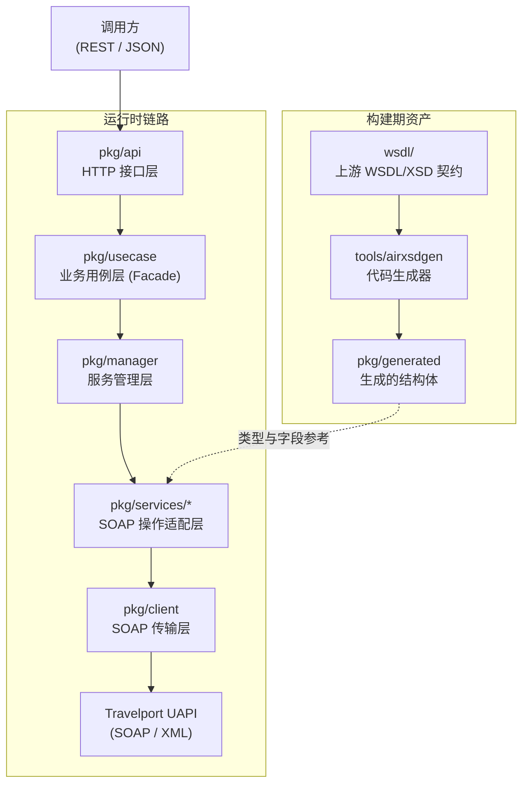
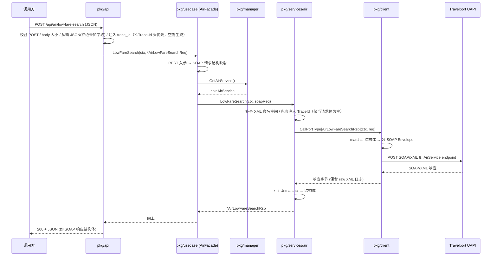
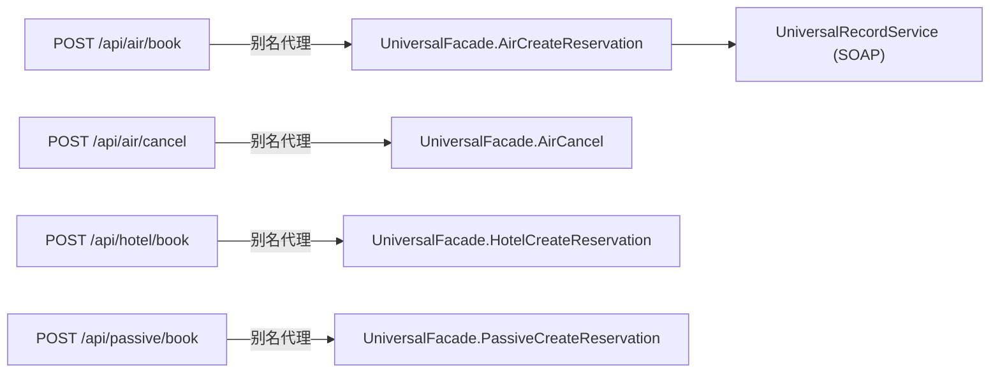
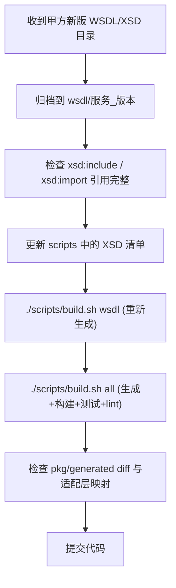

# UAPI Go 架构文档

**[English](./architecture.md)** | 简体中文

> 面向读者：需要把 Travelport UAPI 接入自己系统的工程师、旅行社 / 差旅管理（TMC）/ 机票代理技术团队，以及任何想把 GDS 能力包装成 REST 服务的人。
> 读不懂 GDS 的黑话？先看 [`glossary.md`](./glossary.zh-CN.md)（术语表）。
> 想直接查每个 HTTP 接口对应哪个上游 SOAP 操作？看 [`routing.md`](./routing.zh-CN.md)（路由 ↔ 操作 ↔ 服务对照表）。

---

## 1. 这个项目解决什么问题

[Travelport Universal API（UAPI）](https://developer.travelport.com/) 是 Travelport 提供的 GDS 聚合接口（覆盖机票 Air、酒店 Hotel、火车 Rail、租车 Vehicle、被动段 Passive、统一记录 Universal Record、客户档案 UProfile 等）。它原生是 **SOAP / XML** 协议，按产品拆成多个 Service（如 `AirService`、`HotelService`、`UniversalRecordService`），每个 Service 下又有几十个 PortType 操作（如 `AirSearch`、`HotelCreateReservation`）。

这套接口能力强，但直接对接有三个痛点：

1. **协议重**：SOAP Envelope、命名空间 URI、`xs:sequence` 顺序、枚举值都要手写对齐，出错即报文失败。
2. **范围分散**：同一个产品的"查询"在 `AirService`，而"预订 / 取消"却在 `UniversalRecordService`（见 §4），新手极易找错入口。
3. **契约易变**：Travelport 按版本交付 WSDL/XSD，字段和枚举会随版本变化。

本项目把 UAPI 的这些 SOAP 操作封装成一个 **Go 编写的 REST / JSON 网关**：

- 对外暴露稳定、好调用的 HTTP 接口（`POST /api/<domain>/<op>`）。
- 对内保留 SOAP 的类型安全与报文可追溯性（原始 XML 按 trace_id 留痕）。
- 上游契约（WSDL/XSD）在**构建期**生成 Go 代码，把接口变化前置到编译和测试阶段，而不是运行时。

---

## 2. 分层架构



### 2.1 各层职责（单一职责，互不越界）

| 层 | 目录 | 只负责什么 | 不负责什么 |
|---|---|---|---|
| 进程入口 | `cmd/daemon` | 在单一 HTTP 端口（默认 `8080`）上装配运维端点（`/health` 等）与业务路由，创建 Facade / Handler | 任何业务或 SOAP 细节 |
| HTTP 接口层 | `pkg/api` | 校验 method（仅 POST）、限制 body 大小、JSON 解码（拒绝未知字段）、timeout、错误 → HTTP 状态码、注册路由 | SOAP 字段语义、DTO 映射 |
| 业务用例层 | `pkg/usecase` | 把 REST 入参映射到 SOAP 请求结构；隔离外部 REST 契约与上游 SOAP 契约；调用 `ServiceManager` 取服务实例。**透传型 Facade 标记为「可折叠层」**：无业务逻辑时仅为薄包装，后续需要校验 / 编排时就地生长，不跨层改动 | 直接拼 XML、HTTP 传输 |
| 服务管理层 | `pkg/manager` | 各上游 Service 实例的创建、懒加载与缓存；通过类型安全泛型 `manager.Get[T](m, key)` + 工厂注册表 `buildServiceFactories` 暴露（新增域只需追加一条注册，无需新增 getter，符合开闭原则） | 业务逻辑 |
| SOAP 适配层 | `pkg/services/*` | 定义并组装每个 PortType 的 SOAP 请求 / 响应结构，补齐命名空间，调用 `pkg/client` | REST 协议、鉴权头透传 |
| SOAP 传输层 | `pkg/client` | 组装 Envelope、注入 `Authorization`、超时 / TLS / 连接池、XML 日志、解析 SOAP Fault | 业务字段含义 |
| 生成代码 | `pkg/generated` | WSDL/XSD 翻译出的 Go 结构体（**禁止手工改**） | — |
| 契约源 | `wsdl/` | 甲方按服务 / 版本归档的 XSD 与 WSDL | — |

> **设计要点**：`pkg/api` → `pkg/usecase` → `pkg/services` → `pkg/client` 是一条单向依赖链，每层只懂自己那一小段。新增一个上游操作，改动集中在 `pkg/api`（注册路由）+ `pkg/usecase`（Facade 方法）+ `pkg/services`（组装报文），HTTP 协议与传输层不动。

### 2.2 一次调用发生了什么（以 `POST /api/air/low-fare-search` 为例）



---

## 3. 代码生成：构建期生成，绝不运行时解析

Go 是静态编译语言，本项目**不在运行时加载或解析 XSD**。上游契约在构建期由 `tools/airxsdgen` 翻译成 Go 结构体。

### 3.1 生成规则

`airxsdgen` 按 XSD 的 `targetNamespace` 把 `wsdl/` 下的契约翻译成 Go 包：

- **包名不带版本号**（单版本域，如 `air`、`hotel`、`system`）：契约升级时仅重生成，全仓 import 路径零改动（决策见 §9 ADR-004）。
- **例外：`commonNN` 系保留版本号**（`common32/33/37/55`…）：各遗留域分别锚定自己的 common 版本，多版本真实并存。
- 域类型 → 各自包（如 `air`、`hotel`、`rail`、`vehicle`、`universal`、`uprofile`…）。
- 枚举 → 每个域包下的 `enums` 子包（如 `air/enums`）。
- 保留 `xs:sequence` 顺序、完整命名空间 URI 的 `xml` tag，以及 snake_case 的 `json` tag。

每类 WSDL/XSD 的 Go 包（节选，版本号随甲方交付变化）：

| 模块 | 生成包 | 说明 |
|---|---|---|
| 公共 | `common55` 等 | 跨域共享类型（请求基类、地址、金额、日期等） |
| 机票 | `air` | **合并包**（见 §3.2），含 Air / Rail / UniversalRecord 的相互递归类型 |
| 酒店 | `hotel` | 酒店查询、详情、房价规则等 |
| 火车 | `rail` | 火车查询、退改、座位图等 |
| 租车 | `vehicle` | 租车搜索、位置、规则等 |
| 统一记录 | `universal` | **仅枚举子包**（`universal/enums`），结构体并入 `air` |
| 客户档案 | `uprofile` / `shareduprofile` |  travelers / 代理档案 |
| 预订 | `sharedbooking` | 共享预订（PNR 元素级操作） |
| 工具 | `util` | MCO、MCT、汇率、参考数等 |
| 系统 / 终端 | `system` / `terminal` / `sessioncontext` | 探活、终端仿真会话 |
| 其他 | `gdsqueue` / `cruise` / `passive` | GDS 队列 / 邮轮 / 被动段 |

> 甲方升级契约时：替换 / 新增 `wsdl/` 目录 → 重跑 `./scripts/build.sh wsdl` → `./scripts/build.sh all` → 提交 `pkg/generated` 与适配层 diff。**不要手工改 `pkg/generated/`**。

### 3.2 为什么 `air` 是合并包，`universal` 只剩枚举（重要）

这不是 WSDL 缺口，而是 **Go 语言不允许包循环依赖**的硬约束导致：

- 在 Travelport 的 XSD 中，`air`、`rail`、`universal` 三个命名空间**相互递归引用**：air 引用 rail 的类型，rail 引用 universal（`UniversalRecord`）的类型，universal 又引用 air 的类型，形成一个环。
- 如果按"一个命名空间一个 Go 包"生成，这三个包会互相 import，编译直接报 `import cycle not allowed`。
- 生成器用 Tarjan 强连通分量（SCC）算法识别出这个环，把它们**合并进同一个 Go 包 `air`**。所以在代码里你会看到 `air` 同时包含 `AirSearchReq`、`RailSegmentList`、`UniversalRecord*` 等类型。
- `universal` 因此不再需要承载结构体，只保留 `universal/enums`（枚举无法合并、各自独立）。

**结论**：代码里 `universal` 只有枚举、结构体在 `air`，这是生成器的正常产物，不代表 UAPI 的 UniversalRecord 服务"只有枚举"。UniversalRecord 的全部请求 / 响应结构都在 `air`，对应的业务方法在 `pkg/services/universal` 与 `pkg/usecase.UniversalFacade`。

### 3.3 SOAP 调用如何路由到正确的操作

`pkg/client.CallPortType[T]` 根据**请求结构体的 `XMLName`（完整命名空间 URI + 元素名）**路由到对应的 PortType，而不是靠一个字符串 operation 名。这样即使多个包里有同名方法，也能靠命名空间精确命中上游的 SOAP 操作，避免手工维护 operation 字符串映射。

---

## 3.4 生成器缺陷修复（运行期契约正确性）

两个缺陷都位于构建期生成器 `tools/airxsdgen`，但都表现为「生成成功、编译通过，运行期才暴露」的**静默错误**——比编译错误更难发现，危害也更大。均已在 `tools/airxsdgen/main.go` 修复，并重新生成了 `pkg/generated`。

### 缺陷 A：跨命名空间 `attributeGroup` / `group` 引用被静默丢弃

- **现象**：XSD 里的 `ref="common:providerReservation"` 这类跨命名空间引用，旧实现 `collectAttrs` / `expandGroup` 丢弃 `ref` 的命名空间 URI、只用当前包 `fromNS` 查表，于是永远查不到、被静默丢弃。影响 **77 处跨命名空间 `attributeGroup ref` + 2 处跨命名空间 `group ref`**。
- **具体后果**：`HotelRetrieveReq` 因此丢失了必填的 `ProviderCode` / `ProviderLocatorCode`——报文能发出去，但被 GDS 在运行期直接拒绝。
- **根因**：`qualifyTree` 已把 `ref` 归一化为 `{uri}local`，但查表时没用这个 uri。
- **修复**：`collectAttrs`（`main.go:783` 起）与 `expandGroup`（`main.go:751` 起）改用 `splitQName(ref)` 拆出命名空间，`refNS` 为空时回退 `fromNS`，按 `typeKey{refNS, local}` 查表。内层 `collectAttrs` 仍传 `fromNS` 以承担「目标包」职责（决定类型是否需包限定与 import）；属性的命名空间限定性不受影响，因为全部 58 个 schema 均为 `attributeFormDefault="unqualified"`，两种判定结果一致。
- **验证**：重生成后 `HotelRetrieveReq` 重新包含必填的 `ProviderCode` 与 `ProviderLocatorCode`（v55 升级时已复核 `hotel` 同样完整）。

### 缺陷 B：`xs:date` / `xs:dateTime` 映射为不可序列化的 `time.Time` 具名类型

- **现象**：旧 `builtinTypes` 映射 `"date":"time.Time"`，生成 `type TypeDate time.Time`。Go 的**具名类型不继承 `time.Time` 的 Marshal/Unmarshal 方法**，生成器也未补发，于是 JSON 入站直接报错（`cannot unmarshal string into TypeDate`），XML 出站静默产出空元素 `<CheckinDate></CheckinDate>`，把空日期发给 GDS。共 **29 处字段**受影响（当时的 common32/33/37/54、hotel54、util54 等包）。
- **修复**：`builtinTypes` 改为 `"dateTime":"string", "date":"string"`（与既有 `time` / `duration` → `string` 一致，见 `main.go:304`）。
- **取舍**：放弃严格类型安全 / 格式校验，换取**正确性 + 契约一致**——`string` 与调用方现有的 `"2026-09-01"` JSON 契约一致，不会破坏 `/search`、`/details`。完整取舍见 §9 ADR-001。
- **验证**：JSON `{"checkinDate":"2026-09-01"}` → XML `<CheckinDate>2026-09-01</CheckinDate>` 往返正常。

> **回归测试现状**：`pkg/services/system/system_test.go`（`InjectAndMarshal`、非限定属性断言）与 `pkg/services/util/util_test.go`（注入与序列化往返）覆盖注入与序列化路径；`pkg/services/hotel/hotel_details_models_test.go` 覆盖手写响应模型的解码。**对生成结构体本身（如 `hotel.HotelRetrieveReq` 的字段完整性）尚无直接回归测试**，契约升级时需人工 diff `pkg/generated` 并按 §6 流程全量校验（补齐生成契约快照测试列为演进项，见 §8）。

---

## 3.5 酒店服务模型迁移状态（已完成）

历史背景：酒店服务最初全部使用手写 SOAP 模型（生成器对 `<xs:element ref>` 跨元素引用解析不完整，曾把子元素生成为 `interface{}`，反序列化即丢失）。随着生成器修复，迁移分三步完成，**手写模型已全部退役**（决策见 §9 ADR-005）：

1. **Port 类请求**：6 个 Port 操作改用 `hotel` 生成类型（`hotel_port_models.go` 删除），经 `normalizeHotelPortReq` 统一做 `TargetBranch` 校验与 `InjectInfrastructure` 兜底注入（请求体 `TraceId` 为空时才填 trace_id）。
2. **REST 业务面请求/响应**：`/search`、`/details` 改用生成类型（`hotel_soap_api.go` 中的双 tag 手写模型与约 20 个 `Response*` 子类型删除）；详情自动翻页（NextResultReference 循环、RatePlanType 去重、超时/页数上限）保留，直接运行在生成类型上。
3. **路由注册**：`/search`、`/details` 与其余 Port 操作一样经泛型 `registerPortHandler` 注册，入参校验集中在 facade 层。

JSON 契约影响（破坏性，随迁移生效）：请求/响应字段以 XSD 生成 tag 为准；`transactionId` 入参不再存在（XSD 契约无此字段）；`nextResultReference` 在请求/响应中可见；响应为完整生成模型（不再是被裁剪的「精简版」摘要）。

---

## 4. 路由与职责边界：每个服务只管自己范围内的事

Travelport 的原生设计里，**"查询 / 检索 / 改签 / 退票"在产品自己的 Service 里，而"跨产品的创建预订 / 取消 / 统一修改"在 `UniversalRecordService` 里**。例如：

- `AirService` 有 `AirSearch`、`AirPrice`、`AirTicketing`、`AirExchange`…… 但**没有** `AirCreateReservation` / `AirCancel`。
- 机票的"创建预订"和"取消"是 `UniversalRecordService` 的 `AirCreateReservation` / `AirCancel`。
- 同理，酒店、火车、租车的创建 / 取消也都在 `UniversalRecordService`。
- `UniversalRecordService` 还提供 `UniversalRecordCreate`/`Cancel`/`Modify`/`Retrieve`/`Search`、`SavedTrip*`、`ProviderReservation*`、`Passive*` 等跨产品统一能力。

本项目严格遵循这一边界：

- **产品 Handler**（air / rail / hotel / vehicle）只暴露该产品"自己范围内"的查询与操作。
- **跨产品的预订 / 取消**统一由 `UniversalRecord` 引擎（`pkg/usecase.UniversalFacade`）承载。
- 为了让调用方用起来直观（既想要 Universal 的统一语义，又想要产品化的 URL），我们在产品 Handler 上挂了**别名路由**：



别名路由一览（共 9 条，全部代理到 `UniversalFacade`）：

| 别名路由 | 实际调用（SOAP 操作） | 上游 Service |
|---|---|---|
| `POST /api/air/book` | `AirCreateReservation` | `UniversalRecordService` |
| `POST /api/air/cancel` | `AirCancel` | `UniversalRecordService` |
| `POST /api/hotel/book` | `HotelCreateReservation` | `UniversalRecordService` |
| `POST /api/hotel/cancel` | `HotelCancel` | `UniversalRecordService` |
| `POST /api/rail/book` | `RailCreateReservation` | `UniversalRecordService` |
| `POST /api/vehicle/book` | `VehicleCreateReservation` | `UniversalRecordService` |
| `POST /api/vehicle/cancel` | `VehicleCancel` | `UniversalRecordService` |
| `POST /api/passive/book` | `PassiveCreateReservation` | `UniversalRecordService` |
| `POST /api/passive/cancel` | `PassiveCancel` | `UniversalRecordService` |

> 注意 **rail 没有 `/rail/cancel`**：火车段的取消在 Travelport 里走 `UniversalRecordCancel`（统一记录级取消），因此不提供产品级别名，直接调用 `POST /api/universal/universal-record-cancel`。
>
> `passive`（被动段）在 UAPI 里**没有独立的 WSDL / portType**，只能经由 `UniversalRecordService` 操作；本项目为此单独建了 `PassiveHandler`，把 `/passive/book`、`/passive/cancel` 代理到 `UniversalFacade`。

完整路由见 [`routing.md`](./routing.zh-CN.md)。

---

## 5. 请求 / 响应约定

### 5.1 鉴权与区域（请求级，非启动级）

鉴权与区域都是**请求级**配置，由调用方在**每个 HTTP 请求头**携带，经 `pkg/requestctx` 写入 context，从 `pkg/api` 一路透传到 `pkg/client` 的 SOAP 调用：

- **`Authorization`**：Travelport 鉴权头（如 `Basic xxx` / `Bearer xxx`），`pkg/client` 在每次 `Call` 时从 context 取出并原样透传给 UAPI。**不再使用启动期环境变量 `UAPI_AUTHORIZATION`**，同一个网关注理多个账号时各自在请求头区分。
- **`X-UAPI-Region`**：区域 `americas` / `apac` / `emea`（仅 Production）。`pkg/client` 据此动态拼出端点 `https://<region>.universal-api.travelport.com/B2BGateway/connect/uAPI/<Service>`；不填则回退到 `UAPI_ENDPOINT`（默认 apac 生产环境）。

> 这样设计让网关无状态化：鉴权与区域跟「请求」走，而不是跟「进程」走，多账号 / 多区域共存于同一网关时互不干扰。

### 5.2 请求级业务参数

`TargetBranch`、`ProviderCode`、`OriginApplication`、`CIDBNumber` 等**由调用方在每个请求的 JSON body 里显式提供**，启动配置不再注入。这样同一个网关注多个 Branch / Provider 时互不干扰。

### 5.3 全局追踪 ID（trace_id）

trace_id 优先来自调用方在请求头 `X-Trace-Id` 传入，未传时网关在入口自动生成（UUID v4）。它经 context 贯穿日志 `trace_id` 字段、出站 HTTP 头 `X-Trace-Id`、以及（仅当请求体 `TraceId` 为空时兜底注入的）请求体 `TraceId` 属性，用于全链路排障。网关在响应头 `X-Trace-Id` 回写本次实际使用的 trace_id。

该传播遵循 W3C Trace Context / OpenTelemetry 边界透传原则：trace 走 HTTP 头而非依请求体承载；网关不覆盖调用方在请求体里显式填写的 `TraceId` 业务值（兜底语义见 `common55.BaseCoreReq.InjectInfrastructure`，由生成器 `tools/airxsdgen` 统一生成）。

上游 Travelport 的 `TransactionId` 由其自动生成、唯一标识单次请求-响应对，仅出现在响应 `<...Rsp>` 根属性与 SOAPFault 回显里，网关不注入不透传，直接随响应 JSON 的 `transactionId` / `transaction_id` 字段透出，调用方从响应体读取即可。

### 5.4 超时与重试

- `UAPI_CONNECTION_TIMEOUT` / `UAPI_READ_TIMEOUT` / `UAPI_REQUEST_TIMEOUT`（单位毫秒，默认值见 `README.md`）。
- **本项目不启用重试**：任何单次 SOAP 调用失败（网络 / 系统 / 超时 / 业务错误）都直接返回，由调用方决定如何透传或补偿。GDS 业务错误（如运价失效、座位售罄）以 SOAP Fault 形式透出。

### 5.5 响应结构

- 通用接口（`registerPortHandler` 注册的全部路由）成功时直接写出上游 SOAP 响应的**强类型结构体**（`*XxxRsp`），字段为 snake_case 的 JSON，调用方可直接消费。
- 请求体的 JSON 解码**拒绝未知字段**（`DisallowUnknownFields`），防止调用方拼错字段名而静默失效。
- 上游 SOAP 的**原始 XML 报文保留在日志中**（按 `trace_id` 关联），便于核对 Travelport 报文；酒店 `search` / `details` 这类业务接口还做了显式 DTO 映射以提供更友好的字段。

### 5.6 端口与端点

业务接口与运维端点共用**单一 HTTP 端口**（默认 `8080`，`-port` / `PORT` 可改）：

| 路径 | 方法 | 用途 |
|---|---|---|
| `/api/<domain>/<op>` | POST | 业务接口（181 个） |
| `/health` | GET | 对上游 System 服务发起真实 SystemPing；鉴权由探活方在请求头携带 `Authorization` 透传，失败返回 503 |
| `/ready` | GET | 进程就绪自检 |
| `/stats` | GET | 已创建服务统计（JSON） |
| `/metrics` | GET | Prometheus 指标 |

> **为什么单端口**：网关通常部署在 k8s / 容器平台之后，业务与运维端点共用端口意味着单端口暴露、单 TLS 证书、单负载均衡配置；路径天然不冲突（业务全在 `/api/*` 下）。若部署侧需要把 `/metrics` 限制为仅内网可见，在 ingress / Service 层按路径分流即可，不必在进程内拆端口。
>
> 健康检查为**拉模式**：进程内不做周期性探测（后台任务无请求级凭据可透传，周期探测只会制造噪音），由探活调用方（监控系统 / k8s liveness probe）按需发起并携带凭据。

### 5.7 运维就绪度

- **健康检查（`/health`）真实反映上游可达性**：`ServiceManager.HealthCheck` 对 `System` 服务发起一次真实的 `SystemPing`，仅在 GDS 侧可达且返回成功时才返回 200。鉴权遵循「一切透传」原则——本网关不持有任何 Travelport 凭据，探活方在请求头携带 `Authorization`（与业务请求同一条透传链路）；未携带凭据时上游必然拒绝，`/health` 返回 503，这真实反映了「当前无法验证上游可达」。
- **优雅关闭**：`cmd/daemon` 监听 `SIGINT` / `SIGTERM`，收到信号后先 `http.Server.Shutdown` 停止接入新请求、等待在途请求完成（15s 上限），再 `ServiceManager.Close` 释放各服务连接，最后退出。进程被 kill 时不再丢失在途请求。
- **限流 / 熔断（待办）**：当前未在进程内限制并发 GDS 调用数，GDS 侧限流时可能短时打满连接池；后续可在 `pkg/client` 增加并发信号量（限流）与连续失败熔断，作为独立演进项。

---

## 6. 契约（WSDL/XSD）更新流程



每次升级按此清单：

- 确认交付目录完整（含所有 `include` / `import`）。
- 目录放入 `wsdl/`，名字带服务与版本号。
- 更新生成脚本的 XSD 清单。
- 执行 `./scripts/build.sh wsdl` 与 `./scripts/build.sh all`。
- 对需暴露给 REST 的字段，在 `pkg/usecase` 与 `pkg/services` 显式接入。
- 更新 `docs/` 中对应接口说明。

---

## 7. 目录速览

```text
uapi-go/
  cmd/daemon/        进程入口（业务 API + 运维端点，单端口）
  pkg/api/           HTTP 接口层与路由注册
  pkg/usecase/       业务用例层（每个域一个 Facade）
  pkg/manager/       服务管理层（ServiceManager）
  pkg/services/*/    SOAP 操作适配层（air/rail/vehicle/hotel/universal/...）
  pkg/client/        SOAP 传输层（Envelope / 鉴权 / 日志 / 错误）
  pkg/generated/ 生成的 Go 结构体（禁止手工改）
  pkg/trace/         全局 trace_id
  internal/          日志、指标等内部基础设施
  wsdl/              上游 WSDL/XSD 契约（按服务 / 版本归档）
  tools/airxsdgen/   代码生成器
  scripts/           构建 / 生成 / 启动脚本
  docs/              架构、路由、术语文档
```

## 8. 后续演进方向

- REST API 版本化（`/api/v1`、`/api/v2`），与 SOAP 契约版本解耦。
- 对常用 SOAP Fault 建立统一错误模型，便于调用方程序化处理。
- 将生成脚本纳入 CI，契约升级自动跑全量校验。
- ~~**酒店 `/search`、`/details` 手写模型迁移（P1 遗留）**~~：已完成——手写模型全部删除，请求/响应与路由注册统一走 `hotel` 生成类型与泛型 `registerPortHandler`（见 §3.5、§9 ADR-005）。

---

## 9. 架构决策记录（ADR）

记录本项目已定型的关键技术决策，便于后续维护者理解「为什么是这样做」。

### ADR-001：xs:date / xs:dateTime 映射为 Go string

**状态**：Accepted

**背景**：生成器把 `xs:date` / `xs:dateTime` 映射为 `time.Time` 具名类型，但 Go 具名类型不继承 `time.Time` 的 Marshal/Unmarshal，生成器也未补发，导致 JSON 入站报错、XML 出站静默丢日期。可选方案：(1) 映射为 `string`；(2) 生成完整 marshaler（date 支持类型）；(3) 共享 support 包承载 date 类型。

**决策**：采用方案 (1)——`xs:dateTime` / `xs:date` / `time` / `duration` 统一映射为 `string`（见 `tools/airxsdgen/main.go` 的 `builtinTypes`）。

**后果**：
- 变易：JSON / XML 往返正确，与调用方现有 `"2026-09-01"` 契约一致，不破坏 `/search`、`/details`。
- 变难：放弃编译期格式校验与类型安全；非法日期（如 `"2026-13-40"`）只在运行期被 GDS 拒绝。如需严格校验，可在 usecase 层对关键日期字段做正则 / 解析校验（列为后续可演进项）。

### ADR-002：先修生成器缺陷，再完成酒店迁移

**状态**：Accepted（后续 /search、/details 手写模型退役由 ADR-005 接续）

**背景**：迁移酒店到生成模型时，发现生成器仍有两处静默缺陷（跨命名空间 ref 丢弃、date 不可序列化）；半途迁移会因缺字段 / 错日期在运行期失败。可选方案：(1) 先修生成器再迁移；(2) 回滚生成器改动；(3) 部分迁移（接受运行期缺陷）。

**决策**：采用方案 (1)——先修复 `tools/airxsdgen` 两处缺陷并重生成 `pkg/generated`，再完成酒店 Port 模型迁移；`/search`、`/details` 手写模型保留为待办。

**后果**：
- 变易：酒店 Port 报文字段完整、日期正确；生成器缺陷有回归测试守护，后续契约升级不再复发。
- 变难：重生成触发全量 `pkg/generated` diff 评审成本；`/search`、`/details` 手写模型当时仍需单独排期（后由 ADR-005 完成退役）。

### ADR-003：上游契约 v54_0 → v55_0 主版本升级

**状态**：Accepted

**背景**：Travelport 交付 v55_0 契约（11 个核心域：air/common/cruise/gdsQueue/hotel/passive/rail/sharedBooking/universal/util/vehicle），v54_0 目录同步移除；sharedUprofile_v20_0 不在交付中（后经手动补回）。契约级 diff（版本号归一化后）显示三类实质变更：(1) sharedBooking 新增 7 个车辆 PNR 元素操作；(2) hotel/common 删除 `HotelRateDetailRef`、`BookingTravelerRef`，`HotelSpecialRequest` 简化为纯文本类型；(3) universal 酒店段基数收窄（`HotelProperty`/`HotelStay` 由 `0..99` 变为必填 1，`Guarantee` 等由 `0..99` 变 `0..1`）。

**决策**：
1. 生成器输入清单整体切换 v55_0（Go 包名 `airNN` 系列同步升为 `*55`），全仓 import/别名/注释一次迁移；旧 `*54` 生成包删除。
2. **接受 (3) 的破坏性 REST 契约变更**：`/api/universal/hotel-create-reservation` 等请求中 `hotelProperty` 由 JSON 数组变为单对象，调用方需同步改造——这是上游契约的语义变化，网关不做兼容垫层（避免维护两套形态）。
3. sharedBooking 的 7 个新操作暂不暴露为路由（生成类型已就绪），待有业务需求时按 development.md 场景 A 接入。
4. sharedUprofile_v20_0 的 XSD 引用 `uprofileCommon_v30_0` 命名空间，该 XSD 最初不在仓库中，生成器曾兜底将其解析到最新 common 包（v54 时代→`common54`）。本次升级补充归档 `wsdl/uprofileCommon_v30_0/` 并注册生成器清单（产出 `uprofilecommon` 包），`shareduprofile` 的跨包引用现已按真实命名空间解析，不再依赖兜底行为。

**后果**：
- 变易：与上游 v55 契约完全对齐（含手写酒店 /search、/details 模型的命名空间 URI 同步升版）；两类历史生成缺陷经抽查未复发（`HotelRetrieveReq` 必填属性完整、`TypeDate` 保持 string 基型）；sharedUprofile 依赖链补全（`uprofilecommon`）。
- 变难：universal 酒店预订类接口的 JSON 形态破坏性变化，需调用方公告与迁移期；手写酒店模型当时仅替换了命名空间 URI（现已由 ADR-005 全量退役，该项不再成立）。

### ADR-004：生成包名去版本化，保证契约升级时 import 稳定

**状态**：Accepted

**背景**：v54→v55 升级中，包名带版本号（`air54`→`air55`）导致全仓约 20 个文件的 import 路径、别名与限定符机械改动——这类改动与业务无关、纯由命名引起，每次契约升级都会重演。可选方案：(1) 包名去版本号（`air`），升级时仅重生成；(2) 保留版本号，每次升级做全仓重命名；(3) 引入版本无关的中间接口层隔离。

**决策**：采用方案 (1)。单版本域的 Go 包名一律不带版本号（`air_v55_0` → 包 `air`）；**唯一例外是 `commonNN` 系**——system_v32_0、uprofile_v37_0 等遗留域分别锚定 common_v32_0、common_v37_0，多个 common 版本真实并存，必须以版本号区分。配套约定：

1. services/usecase 层同时 import 同名业务包（`pkg/services/air`，包名 `air`）与生成包（`pkg/generated/air`，包名 `air`）会冲突，生成包统一以 `xsd` 后缀别名导入（`airxsd`、`hotelxsd`）；`commonNN` 无冲突，保持裸导入。
2. 合并包（SCC）与跨命名空间消歧前缀同样无版本：合并包为 `air`（含 air+rail+universal），消歧类型名如 `RailCharacteristic`（旧 `Rail55Characteristic`，前缀源自清单名）。
3. 若未来某域出现双版本并存需求（如灰度新旧契约），该域按 common 先例恢复版本号命名，属新增决策。

**后果**：
- 变易：契约升级（v55→v56）时 `pkg/generated` 重生成后 import 全部保持有效，升级面收敛到生成 diff 与真实契约变更本身；包名即域名，与 AGENTS.md 的包命名规范一致。
- 变难：包名不再自证契约版本——排查线上问题时需查 `xml` tag 里的命名空间 URI（`.../schema/air_v55_0`）才能确认实际契约版本；XML tag/命名空间仍是版本化的，读者不可把「包 `air`」误解为「与版本无关的抽象」。

### ADR-005：手写 SOAP 模型全量退役，生成类型成为唯一真相源

**状态**：Accepted

**背景**：生成器修复跨元素 `ref` 解析后，`pkg/generated/hotel` 已无任何 `interface{}` 字段（历史上迫使酒店 /search、/details 手写约 20 个 `Response*` 模型的技术前提消失）。但 `hotel_soap_api.go` 仍维护一套「json+xml 双 tag」手写模型与显式 DTO 摘要，`service.go` 还残留早期演示期的 `Search`/`Book` 手写模型（无调用方，死代码）。可选方案：(1) 保留手写模型作为 API 契约稳定层；(2) 全量切换到生成类型，接受 REST JSON 契约变化；(3) 生成类型 + 手写兼容 DTO 垫层。

**决策**：采用方案 (2)。删除全部手写 SOAP 模型：

1. `/search`、`/details` 的请求/响应直接使用 `hotelxsd.HotelSearchAvailabilityReq`/`BaseHotelSearchRsp`、`HotelDetailsReq`/`HotelDetailsRsp`；详情自动翻页逻辑（NextResultReference 循环 + RatePlanType 去重 + 超时/页数上限）原样保留，运行在生成类型上（翻页令牌 `common55.NextResultReference` 请求/响应同型，直接回填，不再需要手写转换）。
2. facade 校验复用 `normalizeHotelPortReq`（TargetBranch 非空 + TraceId 兜底注入），8 个酒店操作共享同一条路径；`/search`、`/details` 与其余操作一样经泛型 `registerPortHandler` 注册。
3. 死代码 `Search`/`Book`/`Service` 接口及其手写模型删除。

**后果**：
- 变易：单一真相源——REST JSON 契约即 XSD 契约的 camelCase 投影，契约升级后自动跟进；删除约 500 行平行模型及其测试样板；响应从「裁剪摘要」变为完整生成模型（信息更全，含 `nextResultReference` 翻页令牌）。
- 变难：REST JSON 契约破坏性变化——`transactionId` 请求入参消失（XSD 无此字段，上游的 `TransactionId` 仅出现在响应；请求体 `TraceId` 为空时由网关兜底注入 trace_id）；响应字段集与旧「精简版」不同；`nextResultReference` 在请求侧可见（调用方可携令牌跳页，旧模型以 `json:"-"` 屏蔽）。若上游调整响应结构，REST 契约随之变化，无垫层缓冲——与本项目「升级不兼容旧版」的一贯取舍一致（ADR-003 同理）。
